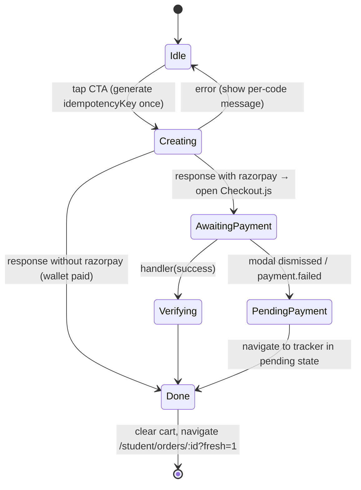

# Phase 2 — Student Ordering: Browse → Cart → Checkout → Pay

> **Project context (all you need to know):** Pocket Canteen lets campus students pre-order from 5 independent canteens and skip the counter queue. Each order belongs to **one canteen**, and payment goes **directly to that canteen** through Razorpay. Students also have a closed-loop **campus wallet**. It is funded only by refunds from cancelled orders and can be spent at any canteen. At checkout, the wallet balance is applied first and Razorpay charges the rest ("split-pay"). When an order is created, the backend returns a public **token** (`A-14`) and a private **4-digit pickup code** (returned only once).
>
> **This phase covers the student's purchase journey,** from choosing a canteen to a paid order. It ends by handing off to the order tracker route `/student/orders/:orderId`. If Phase 3 isn't built yet, a simple confirmation stub is enough.

---

## 1. Goal & Scope
**In scope:** Canteen selector · Menu page (categories, veg filter, sold-out handling, combo suggestions, live availability) · Cart (single-canteen rule, persisted) · Checkout (wallet toggle, split-pay summary, ETA preview) · Razorpay integration · error handling · confirmation hand-off · saving the pickup code locally.
**Out of scope:** the live tracker UI, wallet history, cancel (Phase 3), and the kitchen side (Phase 4).

---

## 2. Bootstrap (only if Phase 1 isn't done)
You need: a Vite React TS app with Tailwind, shadcn (`button card sheet dialog tabs badge skeleton switch`), React Router, TanStack Query, Zustand, MSW, and lucide-react.
Minimal stand-ins:
- `api<T>(path, init)`: a fetch wrapper that throws `ApiError{status, code, message, details}` from the body `{error:{code,message,details}}`.
- A fake auth user `{ id:'u1', name:'Shubh', phone:'+919876543210', role:'student' }`.
- `socket`: an object with `on(event, fn)`, `off(event, fn)` and `emit()`. In mocks it's a simple EventEmitter.
- `formatINR(n)` = `Intl.NumberFormat('en-IN',{style:'currency',currency:'INR'}).format(n)`.
- A `StudentShell` with a bottom nav (Home, Orders, Wallet, Profile) wrapping `<Outlet/>`.

---

## 3. Data Contract

```ts
export interface Canteen {
  id: string; name: string; location: string;
  isOpen: boolean;
  operatingHours: { open: string; close: string };   // "08:00","22:00"
  imageUrl?: string;
  liveQueue: { activeOrders: number; estimatedWaitMins: number };
}
export interface MenuItem {
  id: string; canteenId: string; name: string;
  price: number; category: string; isAvailable: boolean;
  isVeg: boolean; imageUrl?: string; description?: string;
  basePrepSeconds: number;
}
export interface ComboSuggestion { itemIds: string[]; label: string; comboPrice: number; savings: number; confidence: number; }
export interface Wallet { balance: number; updatedAt: string; }

export interface CreateOrderRequest {
  canteenId: string;
  items: { menuItemId: string; quantity: number }[];
  useWallet: boolean;
  idempotencyKey: string;
}
export interface CreateOrderResponse {
  order: {
    id: string; orderUid: string; tokenNo: string; canteenId: string; canteenName: string;
    status: 'placed'; paymentStatus: 'pending' | 'paid';
    totalAmount: number; walletAmountApplied: number; gatewayAmount: number;
    estimatedPrepSeconds: number; targetPickupTime: string; createdAt: string;
    items: { menuItemId: string; name: string; quantity: number; priceAtOrderTime: number }[];
  };
  pickupCode: string;                                     // raw, e.g. "4721"; ONLY time it's sent
  razorpay?: { orderId: string; amount: number; currency: 'INR'; keyId: string }; // amount in paise; absent if wallet covered all
}
```

| Endpoint | Purpose | Notes |
|---|---|---|
| `GET /canteens` | List with `liveQueue` | Refetch every 60s |
| `GET /canteens/:id/menu` | `MenuItem[]` | `staleTime` 5 min |
| `GET /canteens/:id/combos` | `ComboSuggestion[]` (ML via backend) | Hide the section if it fails |
| `POST /predict/eta-preview` | body `{canteenId, items}` → `{estimatedPrepSeconds}` | Optional; hide if it fails |
| `GET /wallet` | `Wallet` | Used for the split-pay preview |
| `POST /orders` | `CreateOrderRequest` → `CreateOrderResponse` | Idempotent on `idempotencyKey` |
| `POST /payments/verify` | `{orderId, razorpay_payment_id, razorpay_order_id, razorpay_signature}` → `{paymentStatus}` | UX speed-up only; the webhook is the source of truth |
| `POST /orders/:id/payment/retry` | → `{razorpay:{...}}` | Reopen the payment window |

**Order errors** (switch on `code`):
| Code | HTTP | UI response |
|---|---|---|
| `ITEM_UNAVAILABLE` | 409 | Highlight `details.menuItemId` in the cart and offer "Remove & continue" |
| `PRICE_CHANGED` | 409 | Refetch the menu and show "Prices updated, please review" |
| `CANTEEN_CLOSED` | 409 | Dialog, then back to the canteen list |
| `INSUFFICIENT_WALLET` | 409 | Refetch the wallet and recompute (the balance changed) |
| `RATE_LIMITED` | 429 | "Slow down, try again in a few seconds" |
| `NETWORK` | 0 | "Couldn't reach server" + Retry (same idempotency key) |

**Socket events** (room `canteen:${canteenId}:public`, joined on the menu page):
- `menu:availability_changed` → `{ menuItemId, isAvailable }`
- `canteen:status_changed` → `{ canteenId, isOpen }`
- `canteen:queue_updated` → `{ canteenId, activeOrders, estimatedWaitMins }`

---

## 4. Screens

### 4.1 Canteen Selector (`/student`)
```text
┌──────────────────────────────┐
│ Hi Shubh 👋        💰 ₹50.00  │
│ 🔍 Search canteens or dishes  │
│ ┌──────────────────────────┐ │
│ │ [image 16:9]              │ │
│ │ Main Canteen              │ │
│ │ Block A · 8 AM – 10 PM    │ │
│ │ 🟢 Open  ⏱ ~8 min · 12 in queue│
│ └──────────────────────────┘ │
│ ┌──────────────────────────┐ │
│ │ Juice Corner   🔥 Rush    │ │  wait > 15 min → "Rush" chip
│ │ 🟢 Open  ⏱ ~18 min        │ │
│ └──────────────────────────┘ │
│ ┌──────────────────────────┐ │
│ │ South Hub (greyed)        │ │
│ │ 🔴 Closed · Opens 8:00 AM │ │
│ └──────────────────────────┘ │
└──────────────────────────────┘
```
- Sort: open canteens first, then ascending `estimatedWaitMins`.
- Search: client-side match on canteen name. If menus are already cached, also match dish names ("Dosa found in South Hub, Main Canteen").
- A closed canteen is still tappable (users can browse), but it shows the reopening time.
- States: 3 skeleton cards while loading · `ErrorState` with retry · `EmptyState` "No canteens yet".

### 4.2 Menu Page (`/student/c/:canteenId`)
```text
┌──────────────────────────────┐
│ ← Main Canteen   ⏱ ~8 min     │
│ [All][Snacks][Meals][South][Drinks]  sticky, horizontal scroll, scroll-spy
│ [ ] Veg only     🔍           │
│ ✨ Frequently ordered together │
│ ┌──────────────┐┌───────────┐│  horizontal carousel
│ │Samosa + Chai ││Coffee+Sand││
│ │₹35 save ₹5   ││₹110 save10││
│ │  [+ Add both]││ [+ Add]   ││
│ └──────────────┘└───────────┘│
│ SNACKS                       │
│ 🟢 Samosa (2 pc)      [img]  │
│ ₹20 · ~3 min      [ − 2 + ]  │
│ 🔴 Chicken Roll       [img]  │
│ ₹70 · ~8 min        [ ADD ]  │
│ 🟢 Masala Dosa  SOLD OUT     │  greyed, no button
│ ┌──────────────────────────┐ │
│ │ 3 items · ₹110  View cart →│ │  floating bar, only if cart has this canteen's items
│ └──────────────────────────┘ │
└──────────────────────────────┘
```
**Behaviour**
- Group by `category` in the order the API returns. Clicking a tab smooth-scrolls to its section. An `IntersectionObserver` highlights the active tab while scrolling.
- "Veg only" filter: client-side, remembered in `localStorage`.
- Prep hint `~N min` = `ceil(basePrepSeconds/60)`.
- Item tap → a bottom `Sheet` with a larger image, description, and an Add button.
- **ADD → stepper.** The stepper reads from `cartStore`, so it stays in sync with the cart sheet.
- **Combo "Add both"** adds each item (qty +1). The saving is shown for information only; the backend applies combo pricing if supported (otherwise just label it "Popular together").
- **Live availability:** on `menu:availability_changed`, patch the query cache. If the item is in the cart and becomes unavailable, remove it and toast *"Masala Dosa just sold out and was removed from your cart."*
- **Closed canteen:** the banner "Closed now · Opens 8:00 AM" shows and every ADD button is disabled.
- Images use `loading="lazy"`, `aspect-square`, and a category-icon placeholder when there's no image.

### 4.3 Cart (bottom Sheet opened from the floating bar)
```text
┌──────────────────────────────┐
│ Your cart · Main Canteen   ✕ │
│ 🟢 Samosa (2 pc)  [−2+]  ₹40 │
│ 🔴 Chicken Roll   [−1+]  ₹70 │
│ ─────────────────────────    │
│ Item total             ₹110  │
│ ✨ Add Masala Chai for ₹15?   │  one combo upsell based on cart contents
│ [ Clear ]   [ Checkout → ]   │
└──────────────────────────────┘
```
**`cartStore` (Zustand + persist, key `pc-cart-v1`)**
```ts
interface CartLine { item: MenuItem; qty: number }
interface CartState {
  canteenId: string | null; canteenName: string | null;
  lines: Record<string, CartLine>;
  add(item: MenuItem, canteenName: string): 'added' | 'needs_switch';
  forceReplace(item: MenuItem, canteenName: string): void;
  inc(id: string): void; dec(id: string): void; remove(id: string): void; clear(): void;
}
export const selectCount = (s) => Object.values(s.lines).reduce((a, l) => a + l.qty, 0);
export const selectSubtotal = (s) => Object.values(s.lines).reduce((a, l) => a + l.qty * l.item.price, 0);
```
**Rules**
1. **One canteen per cart.** If `add()` returns `needs_switch`, open a dialog: *"Start a new cart? Your cart has items from Main Canteen. Adding this will clear it."* → [Cancel] [Start new cart] → `forceReplace`.
2. Quantity is capped at 10 per line. `dec` at qty 1 removes the line.
3. When the cart opens, reconcile it with the latest cached menu: drop unavailable items (with a toast) and refresh prices, flagging any changes with "Price updated" on the line.
4. Empty cart → `EmptyState` "Your cart is empty" + "Browse menu".

### 4.4 Checkout (`/student/checkout`)
```text
┌──────────────────────────────┐
│ ← Checkout                    │
│ Main Canteen · Pickup         │
│ Samosa (2 pc) × 2       ₹40  │
│ Chicken Roll × 1        ₹70  │
│ ────────────────────────     │
│ Item total             ₹110  │
│                              │
│ ⏱ Ready in about 11 min      │  /predict/eta-preview (hidden on error)
│   (around 1:18 PM)           │
│                              │
│ 💰 Use wallet  (₹50 available) [●]│  hidden if balance = 0
│ ────────────────────────     │
│ Wallet                 −₹50  │
│ Pay online (UPI/Card)   ₹60  │
│                              │
│ ⓘ Cancel before cooking starts│
│   for an instant wallet refund│
│ [   Pay ₹60 & Place Order   ]│  sticky bottom
└──────────────────────────────┘
```
**Display maths (the server's numbers win after the order is created)**
```ts
const walletApplied = useWallet ? Math.min(wallet.balance, subtotal) : 0;
const gatewayAmount = +(subtotal - walletApplied).toFixed(2);
const cta = gatewayAmount === 0 ? 'Place Order (Paid by Wallet)' : `Pay ${formatINR(gatewayAmount)} & Place Order`;
```

**Click flow (state machine for the CTA)**


**Steps in detail**
1. `idempotencyKey` is created with `useRef(crypto.randomUUID())`. It is reused on retries of the same attempt and regenerated only if the cart changes.
2. `POST /orders`. While waiting, the button shows a spinner and the whole page is disabled to block double-taps.
3. **Right away, save the pickup code**:
   ```ts
   // stores/pickupCodeStore.ts (Zustand + persist 'pc-pickup-codes-v1')
   save(orderId, { code, tokenNo, savedAt: Date.now() })
   ```
   This code is never sent again. Phase 3 reads it.
4. If `razorpay` exists, load the script once (`https://checkout.razorpay.com/v1/checkout.js`) and open it:
   ```ts
   const rzp = new window.Razorpay({
     key: r.keyId, order_id: r.orderId, amount: r.amount, currency: 'INR',
     name: res.order.canteenName, description: `Pocket Canteen · ${res.order.tokenNo}`,
     prefill: { name: user.name, contact: user.phone },
     theme: { color: '#F97316' },
     handler: async (p) => { await api('/payments/verify', { method: 'POST', json: { orderId: res.order.id, ...p } }).catch(() => {}); finish(); },
     modal: { ondismiss: () => finish({ pending: true }) },
   });
   rzp.on('payment.failed', () => toast.error('Payment failed. You can retry from the order page.'));
   rzp.open();
   ```
   Even if verify fails, the webhook will confirm. Navigate anyway.
5. `finish()` → `cartStore.clear()` → `queryClient.invalidateQueries(['wallet'])` → `navigate('/student/orders/' + id + '?fresh=1')`.

### 4.5 Confirmation (minimum version, if Phase 3's tracker isn't present yet)
`/student/orders/:orderId` stub: a success tick animation · big `TokenChip` · "Pickup code: 4721" (read from `pickupCodeStore`) · "Ready around 1:18 PM" · if payment is pending: a "Payment pending" notice and a **Retry payment** button (`POST /orders/:id/payment/retry` → reopen Razorpay).

---

## 5. Files Created
```text
features/student/canteens/CanteenSelectorPage.tsx, CanteenCard.tsx, useCanteens.ts
features/student/menu/MenuPage.tsx, CategoryTabs.tsx, MenuItemCard.tsx, ItemDetailSheet.tsx, ComboCarousel.tsx, QtyStepper.tsx, useMenu.ts, useMenuLive.ts
features/student/cart/CartSheet.tsx, CartLine.tsx, FloatingCartBar.tsx, CanteenSwitchDialog.tsx
features/student/checkout/CheckoutPage.tsx, PaymentSummary.tsx, WalletToggle.tsx, useCreateOrder.ts
lib/payments/razorpay.ts       # loadScript + openCheckout(opts): Promise<'success'|'dismissed'>
stores/cartStore.ts, stores/pickupCodeStore.ts
mocks/handlers/canteens.ts, menu.ts, orders.ts, wallet.ts, mocks/fixtures/canteens.json, menu.json
```

## 6. Mocks
- Fixtures: 5 canteens (one closed, one in "rush"), about 12 items each (2 sold out), 3 combos per canteen.
- `POST /orders`: validates availability (returns 409 `ITEM_UNAVAILABLE` if any item is sold out), computes totals, picks a token `A-${n}` and a random 4-digit code, and returns `razorpay` only when the gateway amount is above 0.
- **Razorpay in mock mode:** replace `openCheckout` with a fake modal: "Simulate Success / Simulate Failure / Close".
- Mock socket: a dev button "Toggle Samosa availability" emits `menu:availability_changed`.
- Wallet fixture: ₹50.

## 7. Acceptance Criteria
- [ ] Canteens are sorted correctly; closed and rush canteens are styled correctly.
- [ ] Menu tabs scroll-spy works, the veg filter persists, and sold-out items can't be added.
- [ ] Adding from a second canteen triggers the switch dialog. The cart survives a page reload.
- [ ] A live sold-out event removes the item from the cart, with a toast.
- [ ] Wallet toggle: the summary maths is correct for balance below, equal to, and above the total. A balance of 0 hides the toggle.
- [ ] A fully wallet-paid order skips Razorpay.
- [ ] Double-tapping the CTA creates **one** order (same idempotency key).
- [ ] Each error code in §3 shows the correct UI.
- [ ] After success, the cart is empty, the pickup code is in localStorage, and you land on `/student/orders/:id`.
- [ ] Dismissing Razorpay still navigates to the order, which shows a pending state with Retry.

## 8. Tests
- Unit: cart rules, split-pay maths (`50/110 → 50 + 60`, `200/110 → 110 + 0`), idempotency key reuse.
- Component (MSW): checkout → `ITEM_UNAVAILABLE` → "Remove & continue" → success.
- E2E: Canteen → add 2 items → checkout → simulate success → token visible.

## 9. Demo (3 min)
Log in → see live wait times → open Main Canteen → filter veg → add the Samosa + Chai combo → try adding from Juice Corner (switch dialog) → toggle Samosa sold out from the dev panel (removed from cart) → checkout with the wallet → pay ₹60 in test mode → token A-14 and code shown.
