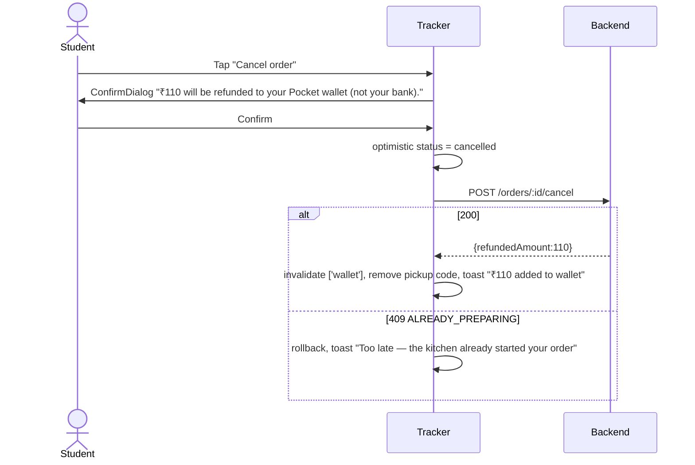

# Phase 3 — Student Live Tracking, Pickup Code, Cancellation, History & Wallet

> **Project context (all you need to know):** Pocket Canteen lets students pre-order campus food. After an order is paid, it moves through these statuses: `placed → queued → preparing → ready → completed`. It can be `cancelled` while still `placed`/`queued` (by the student, with an instant refund to their campus wallet) or later by staff. Each order has a **public token** (`A-14`) shown on kitchen screens and a **private 4-digit pickup code**. The backend stores only a hash of the code, so the student app receives the raw code **once**, when the order is created, and must keep it. The ML service predicts the prep time (`estimatedPrepSeconds`, `targetPickupTime`) and the backend pushes updates over Socket.io. Shortly before the food is ready, the backend sends a **"call-to-walk"** event so the student leaves for the counter at the right time. The **wallet** is closed-loop: credited by refunds, debited at checkout, and every change is an append-only ledger entry.
>
> **This phase covers everything after the student has paid:** watching the order live, collecting it, cancelling it, and seeing history and wallet money.

---

## 1. Goal & Scope
**In scope:** Live Order Tracker · step tracker · server-synced ETA countdown · pickup code vault (show, hide, auto-reveal, resend) · call-to-walk and ready alerts (vibrate, sound, notification, tab title) · payment-pending state with retry · student cancel → wallet refund · active-order banner on Home · Order History (Active/Past, Reorder) · Wallet page (balance and ledger).
**Out of scope:** placing orders (Phase 2) and the kitchen board (Phase 4).

---

## 2. Bootstrap (only if earlier phases aren't done)
- React + TS + Tailwind + shadcn (`card dialog tabs badge skeleton button`), React Router, TanStack Query, Zustand (persist), date-fns, lucide-react.
- `api<T>()` fetch wrapper that throws `ApiError{status,code,message}`.
- A `socket` with `on/off/emit` (an EventEmitter in mocks), plus `connectionStore` with `'connected'|'reconnecting'|'offline'`.
- `formatINR`, `formatTime(iso) → "1:18 PM"`, `timeAgo(iso)`.
- The **pickup code store** (create it here if Phase 2 didn't):
  ```ts
  // stores/pickupCodeStore.ts — Zustand + persist('pc-pickup-codes-v1')
  interface Entry { code: string; tokenNo: string; savedAt: number }
  interface S { codes: Record<string, Entry>; save(id: string, e: Entry): void; get(id: string): Entry | undefined; remove(id: string): void; purgeOld(): void /* > 24h */ }
  ```
- To test without Phase 2: a dev button "Create mock order" that seeds an order and saves code `4721`.

---

## 3. Data Contract

```ts
export type OrderStatus = 'placed' | 'queued' | 'preparing' | 'ready' | 'completed' | 'cancelled';
export type PaymentStatus = 'pending' | 'paid' | 'failed' | 'refunded_to_wallet';
export interface Order {
  id: string; orderUid: string; tokenNo: string;
  canteenId: string; canteenName: string; counterLabel?: string;   // "Counter A"
  status: OrderStatus; paymentStatus: PaymentStatus;
  items: { menuItemId: string; name: string; quantity: number; priceAtOrderTime: number }[];
  totalAmount: number; walletAmountApplied: number; gatewayAmount: number;
  estimatedPrepSeconds: number | null; targetPickupTime: string | null;
  paymentExpiresAt?: string;       // when pending: createdAt + 10 min
  createdAt: string; updatedAt: string;
  readyAt?: string; completedAt?: string;
  cancelReason?: string; refundedAmount?: number;
}
export type WalletEntryType = 'checkout_hold' | 'checkout_capture' | 'hold_release' | 'refund_credit' | 'admin_adjustment' | 'expiry';
export interface Wallet { balance: number; updatedAt: string }
export interface LedgerEntry { id: number; entryType: WalletEntryType; amount: number; orderUid?: string; canteenName?: string; reason: string; balanceAfter: number; createdAt: string }
export interface Page<T> { items: T[]; nextCursor: string | null }
```

| Endpoint | Purpose |
|---|---|
| `GET /orders/:id` | Single order (tracker) |
| `GET /orders?scope=active` | Non-terminal orders (Home banner, Active tab) |
| `GET /orders?scope=past&cursor=` | `Page<Order>` (Past tab) |
| `POST /orders/:id/cancel` | `{reason?}` → `{order, refundedAmount}` · errors: `409 ALREADY_PREPARING`, `409 NOT_CANCELLABLE` |
| `POST /orders/:id/payment/retry` | → `{razorpay:{orderId,amount,currency,keyId}}` · `410 PAYMENT_EXPIRED` |
| `POST /orders/:id/pickup-code/resend` | Regenerates the code and sends it by SMS → `{sent:true}` · `429` (**confirm with Member 1**) |
| `GET /wallet` | `Wallet` |
| `GET /wallet/ledger?type=all|credit|debit&cursor=` | `Page<LedgerEntry>` |
| `GET /time` (or the HTTP `Date` header) | Server time, for clock-offset sync |

**Socket events** (the student is auto-joined to room `user:${userId}` on connect):
| Event | Payload | Effect |
|---|---|---|
| `order:status_changed` | `{ orderId, from, to, order: Order }` | Patch the order in the cache |
| `order:eta_updated` | `{ orderId, estimatedPrepSeconds, targetPickupTime }` | Patch the ETA, maybe show a "delayed" notice |
| `order:call_to_walk` | `{ orderId, tokenNo, counterLabel }` | Walk alert + reveal the code |
| `order:cancelled` | `{ orderId, reason, refundedAmount, cancelledBy: 'student'|'staff'|'system' }` | Cancelled state, remove the code |
| `wallet:updated` | `Wallet` | Patch the balance, invalidate the ledger |

**Stale-event guard (apply in every handler):** ignore the event if `incoming.order.updatedAt < cached.updatedAt`.

---

## 4. Screens

### 4.1 Live Order Tracker (`/student/orders/:orderId`)
```text
┌──────────────────────────────┐
│ ← PKT-20261005-0042       🟢  │
│         Your token            │
│      ┌──────────────┐         │
│      │    A-14      │         │  TokenChip xl
│      └──────────────┘         │
│   Main Canteen · Counter A    │
│                              │
│  ●━━━━━━━●━━━━━━━○━━━━━━━○    │
│ Received Preparing Ready Collected
│                              │
│      Ready in 07:42          │  EtaCountdown
│      about 1:18 PM           │
│  ▓▓▓▓▓▓▓▓▓▓░░░░░░  62%       │
│                              │
│ ┌──────────────────────────┐ │
│ │ 🔒 Pickup code   👁 Show  │ │  PickupCodeCard
│ │       • • • •             │ │
│ │ Say it only at the counter│ │
│ └──────────────────────────┘ │
│ Items: Samosa ×2, Chicken Roll ×1
│ Paid: ₹50 wallet + ₹60 online │
│ [ Cancel order ]             │
└──────────────────────────────┘
```

**Per-status rendering**
| Condition | Headline | Step | Countdown | Code card | Actions |
|---|---|---|---|---|---|
| `paymentStatus='pending'` | "Waiting for payment" | none | Payment window `mm:ss` until `paymentExpiresAt` | hidden | **Retry payment** · Cancel |
| `placed`/`queued` (paid) | "Order received 👍" | 1 | ETA | masked | **Cancel order** |
| `preparing` | "Chef is cooking 👨‍🍳" | 2 | ETA | masked | — |
| after `call_to_walk` | "Head to Counter A now 🚶" | 2 | ETA | **auto-revealed** | — |
| `ready` | "Ready! Collect at Counter A 🎉" | 3 | "Waiting for you · since 1:17 PM" | **revealed, large** | — |
| `completed` | "Enjoy your meal! 😋" | 4 | — | removed | Reorder · Back home |
| `cancelled` | "Order cancelled" + reason | — | — | removed | "₹110 refunded to wallet" → Wallet |
| `?fresh=1` | One-off success animation (1.2s) + a coach mark about the code | | | | |

**StepTracker component**: 4 nodes. The current node pulses and completed nodes are filled with the brand colour. Connector lines animate their width on transition (Tailwind `transition-all duration-700`). Status changes are announced through an `aria-live="polite"` region.

**EtaCountdown — exact algorithm**
```ts
// clock sync once per session
const offset = serverNowMs - Date.now();            // from GET /time or the Date header
const now = () => Date.now() + offset;

// every 1000 ms
const remaining = Math.round((Date.parse(order.targetPickupTime!) - now()) / 1000);
const total = (Date.parse(order.targetPickupTime!) - Date.parse(order.createdAt)) / 1000;
const pct = Math.min(98, Math.max(0, (1 - remaining / total) * 100)); // 100 only when ready
display = remaining > 0 ? formatMMSS(remaining) : 'Almost there…';
```
- On `order:eta_updated`, animate the bar to its new position. If the new target is **more than 2 minutes later**, show an inline amber notice: *"Kitchen is busier than expected — new time 1:22 PM."* If it's earlier, show a green "Good news, it's coming sooner".
- Pause the interval while the tab is hidden and resume (recomputing) on `visibilitychange`.

**PickupCodeCard**
- Reads `pickupCodeStore.get(orderId)`.
- Masked `• • • •` by default. Tapping "Show" reveals it for 10s, then it re-masks.
- **Auto-reveal** on `call_to_walk` or `ready`, and **enlarged** (text-6xl mono) when ready so the student can show the phone screen.
- **Missing code** (new device or cleared storage): *"Code not saved on this device."* → **[Send code by SMS]** → `POST /pickup-code/resend` → "Sent to +91 •••••43210". On 429, show a cooldown.
- When the order reaches `completed` or `cancelled`, call `pickupCodeStore.remove(orderId)`. On app start, call `purgeOld()`.
- Never log the code, and never put it in the URL or in analytics.

**Alerts on `call_to_walk` and `ready`**
1. `navigator.vibrate?.([200,100,200])`
2. Play `/sounds/chime.mp3` (fails silently if autoplay is blocked)
3. `document.title = '🔔 A-14 Ready!'`, restored on focus
4. If `Notification.permission === 'granted'` and the tab is hidden → `new Notification('Your order A-14 is ready', { body: 'Collect at Counter A', tag: orderId })`
5. **Ask for notification permission only after the first order**, with a soft prompt card on the tracker: *"Get notified when food is ready? [Enable]"*

**Payment pending flow**
- A countdown to `paymentExpiresAt`. **Retry payment** → `POST /payment/retry` → open Razorpay (same loader as Phase 2: `checkout.razorpay.com/v1/checkout.js`).
- `410 PAYMENT_EXPIRED` or `order:cancelled` with `cancelledBy:'system'` → *"Payment not completed in time. Any wallet amount on hold (₹50) has been released."*

**Cancel flow**

The Cancel button appears **only** when `status ∈ {placed, queued}`. It disappears the moment `preparing` arrives, even if the dialog is open (the dialog closes and shows a toast).

**Live wiring + fallback**
```ts
useSocketEvent('order:status_changed', (p) => p.orderId === id && patchOrder(qc, p.order));
useSocketEvent('order:eta_updated',    (p) => p.orderId === id && patchEta(qc, p));
useSocketEvent('order:call_to_walk',   (p) => p.orderId === id && walkAlert(p));
useSocketEvent('order:cancelled',      (p) => p.orderId === id && markCancelled(qc, p));
// Fallback: if connection !== 'connected' for >10s → refetchInterval 15_000 on useQuery(['order', id])
// On reconnect or visibilitychange → refetch
```

### 4.2 Active Order Banner (Home, top of `/student`)
```text
┌──────────────────────────────┐
│ 🟠 A-14 · Preparing · ~1:18 PM →│  one row per active order (max 2, then "+1 more")
└──────────────────────────────┘
```
Data: `GET /orders?scope=active`, patched by the same socket events. It disappears when no orders are active.

### 4.3 Order History (`/student/orders`)
```text
[ Active (1) ] [ Past ]
┌──────────────────────────────┐
│ A-14 · Main Canteen   Preparing│
│ Samosa ×2, Chicken Roll ×1    │
│ ₹110 · Today 1:05 PM          │
└──────────────────────────────┘
Past:
│ A-09 · Juice Corner  Collected │ [Reorder]
│ A-03 · South Hub     Cancelled │ refunded ₹60
```
- The Past tab uses infinite scroll (`useInfiniteQuery` + IntersectionObserver sentinel).
- **Reorder** → for each item, check the canteen's current menu (`GET /canteens/:id/menu`), add the available ones to the cart (`cartStore`, or a localStorage `pc-cart-v1` if Phase 2 is absent), toast which items were skipped, and navigate to the menu page.
- Empty states: "No active orders. Hungry? → Browse canteens" / "No past orders yet".

### 4.4 Wallet (`/student/wallet`)
```text
┌──────────────────────────────┐
│ ┌──────────────────────────┐ │
│ │ Pocket Wallet             │ │  gradient card
│ │ ₹ 160.00                  │ │
│ │ Usable at all 5 canteens  │ │
│ └──────────────────────────┘ │
│ ⓘ Refunds from cancelled      │
│   orders are added here.      │
│ [All] [Credits] [Debits]      │
│ TODAY                         │
│ ↩  Refund · A-11 Main Canteen │
│    +₹110        bal ₹160 1:22 PM│
│ 🛒 Paid · A-14 Main Canteen    │
│    −₹50         bal ₹50  1:05 PM│
│ ⏳ On hold · A-15  (pending)   │
│    −₹30         bal ₹20  …     │
└──────────────────────────────┘
```
**Entry presentation map**
| entryType | Icon | Label | Colour |
|---|---|---|---|
| `refund_credit` | `Undo2` | Refund · {orderUid} | green, `+` |
| `checkout_hold` | `Hourglass` | On hold for {orderUid} | amber |
| `checkout_capture` | `ShoppingBag` | Paid · {orderUid} | slate, `−` |
| `hold_release` | `Unlock` | Hold released · {orderUid} | green, `+` |
| `admin_adjustment` | `ShieldCheck` | Adjustment by admin · {reason} | blue |
| `expiry` | `Clock` | Credit expired | red |

- Grouped by day ("Today", "Yesterday", "12 Sep"), with infinite scroll.
- `wallet:updated` → patch the balance (animated count-up) and invalidate the ledger.
- **No "Add money" button.** The wallet is funded only by refunds. Explain this in the info line.
- The wallet chip in the top bar reads the same `['wallet']` query.

---

## 5. Files Created
```text
features/student/tracker/OrderTrackerPage.tsx, StepTracker.tsx, EtaCountdown.tsx, PickupCodeCard.tsx, PaymentPendingPanel.tsx, CancelOrderButton.tsx, useOrderLive.ts, alerts.ts
features/student/orders/OrderHistoryPage.tsx, OrderCard.tsx, ActiveOrderBanner.tsx, useReorder.ts
features/student/wallet/WalletPage.tsx, BalanceCard.tsx, LedgerList.tsx, ledgerMeta.ts
lib/time/serverClock.ts
stores/pickupCodeStore.ts (if not present)
mocks/handlers/orders.ts, wallet.ts · mocks/simulator.ts
public/sounds/chime.mp3
```

## 6. Mocks — the order simulator
`mocks/simulator.ts` drives a seeded order through its lifecycle using the mock socket:
| t | Event |
|---|---|
| 0s | order `queued`, ETA 90s |
| 15s | `preparing` |
| 30s | `eta_updated` (+150s, triggers the "delayed" notice) |
| 60s | `call_to_walk` |
| 75s | `ready` |
| manual | Dev panel button "Staff verified code" → `completed` |
Dev panel buttons: "Cancel by staff", "Payment expires", "Drop socket 20s" (to test the polling fallback), "Clear local code".
Mock cancel returns 409 when the simulated status is `preparing`. Mock wallet starts at ₹50 with 8 ledger entries covering every type.

## 7. Acceptance Criteria
- [ ] The tracker shows the correct UI for **every** row in the per-status table.
- [ ] The countdown is correct even with the device clock set 5 minutes wrong (offset test).
- [ ] An ETA delay of more than 2 min shows the amber notice. The countdown never goes negative.
- [ ] The code is masked by default, auto-reveals on call-to-walk and ready, and is deleted on completed/cancelled. Missing code → the resend flow works.
- [ ] Cancel while queued → refund toast and the wallet increases live. Cancel racing with `preparing` → rollback toast.
- [ ] The socket drop simulation → polling kicks in, and a refetch happens on reconnect.
- [ ] Payment pending → retry works. Expiry shows the hold-released message.
- [ ] History infinite-scrolls. Reorder skips unavailable items with a notice.
- [ ] Every ledger entry type renders with the correct sign and colour. The balance animates on `wallet:updated`.

## 8. Tests
- Unit: countdown maths with offset, stale-event guard, `ledgerMeta`, `purgeOld`.
- Component: StepTracker for each status. PickupCodeCard reveal/re-mask timer (fake timers). Cancel 409 rollback.
- E2E: run the simulator end to end and assert each headline appears in order.

## 9. Demo (3 min)
Open the tracker → watch it move from Received to Preparing → see the "Kitchen busier" notice → phone vibrates with "Head to Counter A" and the code is revealed → Ready → staff verifies → "Enjoy your meal". Place another order → cancel → wallet card counts up by ₹110 → ledger shows the refund.
