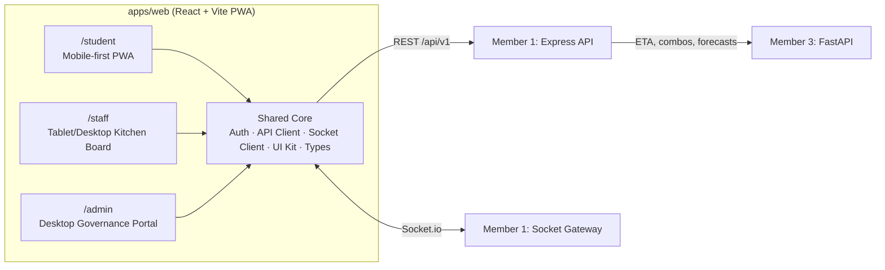
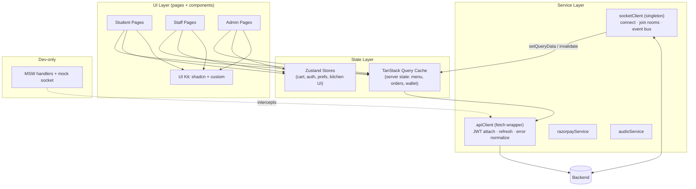
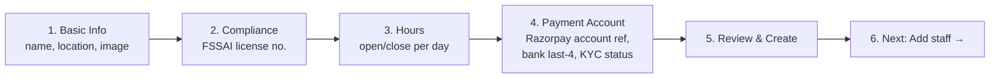
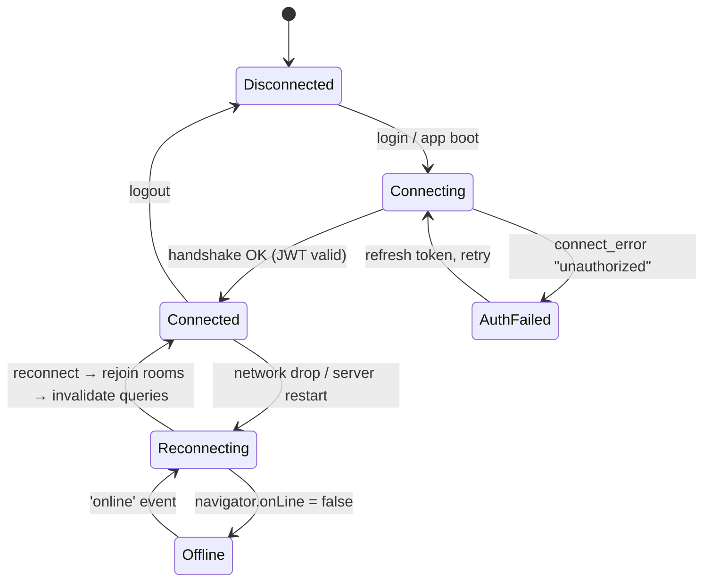
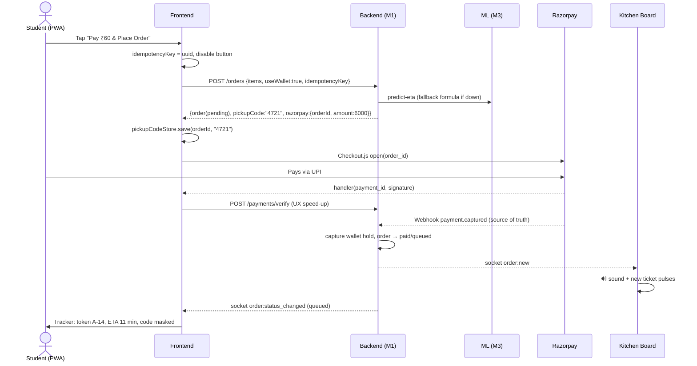
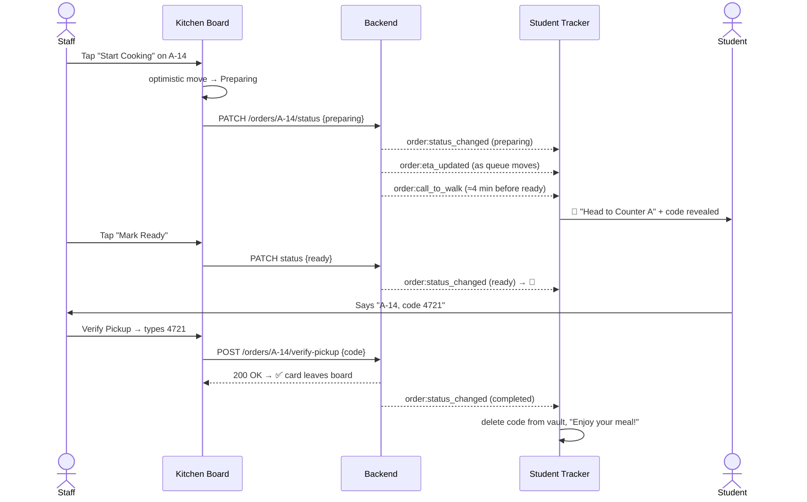
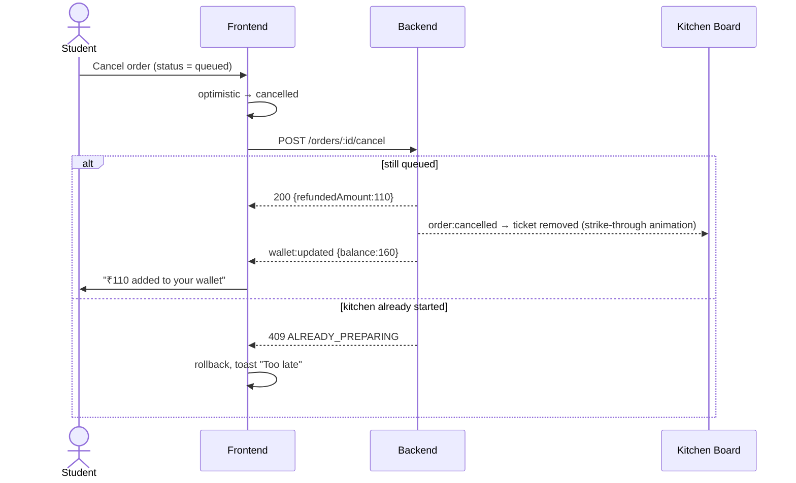
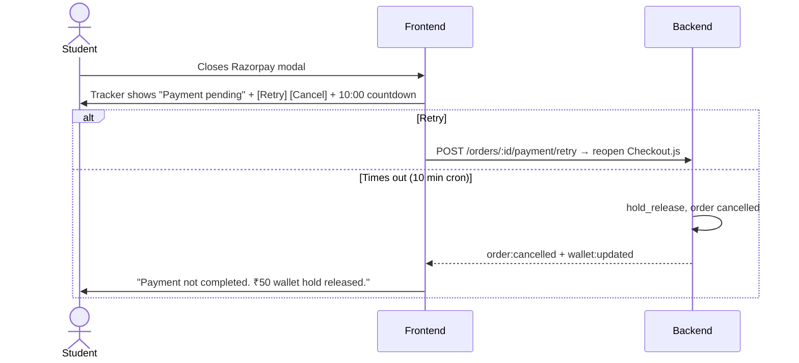

# Pocket Canteen — Member 2 Frontend Blueprint (End-to-End)

**Role:** Frontend & Real-Time UX Lead
**Owns:** `apps/web/` (one React app, three role-based experiences) + co-owns `packages/shared-types/`
**Doesn't own:** DB, payment verification, ledger logic (Member 1); ETA, forecasts, combos (Member 3). The frontend **displays** these. It never **computes** them.

> [!IMPORTANT]
> Golden rule: **the frontend is never the source of truth.** Money, order status, ETA and pickup codes all come from the backend. The UI can update optimistically, but it must always reconcile with the server's answer (REST response or socket event).

---

## 0. The Big Picture — What Member 2 Builds



| Experience | Device target | Main users | Core job |
|---|---|---|---|
| **Student App** | Phone (360–430px), installable PWA | ~25k students | Pick canteen, order, pay, track, collect |
| **Kitchen Board** | Landscape tablet / counter monitor (1024–1920px), touch | Canteen staff | See incoming orders instantly, move them through stages, verify pickup |
| **Admin Portal** | Desktop (1280px+) | Platform admin | Onboard canteens, create staff accounts, run monthly settlements |

---

## 1. Tech Stack (and why each choice)

| Concern | Library | Why |
|---|---|---|
| Build / dev server | **Vite + React 18 + TypeScript** | Fast HMR, team plan mandate |
| Styling | **Tailwind CSS** | Utility-first, fast responsive work |
| Components | **shadcn/ui** (Radix primitives) | Accessible Dialog, Sheet, Tabs, Toast, Select; you own the code |
| Icons | **lucide-react** | Team plan mandate |
| Routing | **React Router v6** (data routers, `createBrowserRouter`) | Nested layouts per role, loaders, route guards |
| Server state | **TanStack Query v5** | Caching, refetch, retries, and the socket can patch the cache directly |
| Client state | **Zustand** (+ `persist` middleware) | Cart, auth session, UI prefs. Tiny, no boilerplate |
| Forms + validation | **react-hook-form + zod** | Onboarding wizard, login, cancel reason. Zod schemas can live in shared-types |
| Real-time | **socket.io-client** | Team plan mandate; matches Member 1's broker |
| Drag & drop | **@dnd-kit/core + sortable** | Touch support (tablets), accessible keyboard DnD |
| Charts | **Recharts** | Peak hours, top dishes, forecast bars, menu matrix scatter |
| Payments | **Razorpay Checkout.js** (script tag) | Opens the gateway modal on the client |
| PWA | **vite-plugin-pwa** (Workbox) | Manifest, service worker, offline caching |
| Audio | **Howler.js** (or the native Web Audio API) | Reliable kitchen alert sounds, handles autoplay unlock |
| Dates / timers | **date-fns** | Countdown, "2 min ago" labels |
| Mocking | **MSW (Mock Service Worker)** + a fake socket emitter | Build everything before the backend exists |
| Testing | **Vitest + React Testing Library + Playwright** | Unit, component and end-to-end tests |
| Lint/format | ESLint + Prettier + `tsc --noEmit` in CI | |

---

## 2. Frontend Architecture (layers)



**Key pattern: "REST to load, socket to patch."**
1. A page loads its data with a TanStack Query (`GET /orders/active`).
2. The socket client receives `order:status_changed`.
3. The handler calls `queryClient.setQueryData(['orders','active'], patchFn)`, so the UI updates without a refetch.
4. After any socket reconnect, the app invalidates the affected queries. That full refetch covers any events missed while offline.

---

## 3. Folder Structure — `apps/web/`

```text
apps/web/
├── public/
│   ├── icons/                     # PWA icons 192/512, maskable
│   ├── sounds/new-order.mp3       # kitchen alert
│   ├── sounds/order-ready.mp3
│   └── manifest.webmanifest       # (generated by vite-plugin-pwa)
├── src/
│   ├── main.tsx                   # QueryClientProvider, RouterProvider, Toaster
│   ├── app/
│   │   ├── router.tsx             # all routes + guards
│   │   ├── providers.tsx
│   │   └── queryClient.ts
│   ├── lib/
│   │   ├── api/
│   │   │   ├── client.ts          # fetch wrapper, token refresh, ApiError
│   │   │   ├── endpoints.ts       # typed functions per endpoint
│   │   │   └── queryKeys.ts       # centralized query keys
│   │   ├── socket/
│   │   │   ├── socketClient.ts    # singleton, auth handshake, reconnection
│   │   │   ├── useSocketEvent.ts  # hook: subscribe/unsubscribe
│   │   │   └── handlers/          # studentHandlers.ts, kitchenHandlers.ts
│   │   ├── payments/razorpay.ts
│   │   ├── audio/audioService.ts
│   │   ├── format.ts              # ₹ currency, time, token
│   │   └── utils.ts               # cn(), etc.
│   ├── stores/
│   │   ├── authStore.ts
│   │   ├── cartStore.ts
│   │   ├── pickupCodeStore.ts     # see §8.6 — local vault for raw codes
│   │   └── kitchenPrefsStore.ts   # sound on/off, column density
│   ├── components/
│   │   ├── ui/                    # shadcn generated
│   │   ├── common/                # StatusBadge, Price, EmptyState, ErrorState, OfflineBanner, ConnectionDot
│   │   └── layout/                # StudentShell, StaffShell, AdminShell
│   ├── features/
│   │   ├── auth/                  # LoginStudent (OTP), LoginStaff, guards
│   │   ├── student/
│   │   │   ├── canteens/          # CanteenSelectorPage, CanteenCard
│   │   │   ├── menu/              # MenuPage, MenuItemCard, CategoryTabs, ComboSuggestion
│   │   │   ├── cart/              # CartSheet, CartLine, CanteenSwitchDialog
│   │   │   ├── checkout/          # CheckoutPage, WalletToggle, PaymentSummary
│   │   │   ├── tracker/           # OrderTrackerPage, StepTracker, EtaCountdown, PickupCodeCard
│   │   │   ├── orders/            # OrderHistoryPage
│   │   │   └── wallet/            # WalletPage, LedgerList
│   │   ├── staff/
│   │   │   ├── board/             # KitchenBoardPage, KanbanColumn, OrderTicket
│   │   │   ├── pickup/            # PickupVerifyModal, PinPad
│   │   │   ├── cancel/            # CancelOrderDialog
│   │   │   ├── menu/              # MenuManagerPage, AvailabilityToggle
│   │   │   └── analytics/         # StaffAnalyticsPage, PeakHoursChart, TopDishes, PrepSheet, MenuMatrix
│   │   └── admin/
│   │       ├── dashboard/         # AdminOverviewPage
│   │       ├── canteens/          # CanteenListPage, OnboardingWizard, CanteenDetailPage
│   │       ├── staff/             # StaffProvisioningPage, CredentialRevealDialog
│   │       └── settlements/       # SettlementsPage, NetFlowTable, SettlementDetailDrawer
│   ├── mocks/
│   │   ├── browser.ts             # MSW setup
│   │   ├── handlers/*.ts
│   │   ├── fixtures/*.json        # from Member 3's synthetic data
│   │   └── mockSocket.ts          # emits fake order:new every N seconds
│   └── styles/globals.css
├── tests/e2e/*.spec.ts            # Playwright
├── vite.config.ts
├── tailwind.config.ts
└── .env.example                   # VITE_API_URL, VITE_WS_URL, VITE_RAZORPAY_KEY_ID, VITE_USE_MOCKS
```

---

## 4. Shared Types Contract (`packages/shared-types`)

Member 2 drafts this in **Week 1** and gets sign-off from Member 1. Everything else depends on it.

```ts
// enums.ts
export type Role = 'student' | 'staff' | 'admin';
export type OrderStatus = 'placed' | 'queued' | 'preparing' | 'ready' | 'completed' | 'cancelled';
export type PaymentStatus = 'pending' | 'paid' | 'failed' | 'refunded_to_wallet';
export type WalletEntryType =
  | 'checkout_hold' | 'checkout_capture' | 'hold_release'
  | 'refund_credit' | 'admin_adjustment' | 'expiry';

// canteen.ts
export interface Canteen {
  id: string;
  name: string;
  location: string;
  isOpen: boolean;
  operatingHours: { open: string; close: string }; // "08:00"
  imageUrl?: string;
  liveQueue?: { activeOrders: number; estimatedWaitMins: number }; // from ML/fallback
}

// menu.ts
export interface MenuItem {
  id: string;
  canteenId: string;
  name: string;
  price: number;          // rupees, 2dp
  category: string;
  isAvailable: boolean;
  imageUrl?: string;
  isVeg?: boolean;        // FE request to Member 1 (Indian campus UX need)
  basePrepSeconds?: number;
}
export interface ComboSuggestion {    // Member 3 /menu-intelligence
  itemIds: string[];
  label: string;          // "Cold Coffee + Grilled Veg Sandwich"
  savings?: number;
  confidence: number;
}

// order.ts
export interface OrderLine { menuItemId: string; name: string; quantity: number; priceAtOrderTime: number; }
export interface Order {
  id: string;
  orderUid: string;       // PKT-20261005-0042
  tokenNo: string;        // A-14
  canteenId: string;
  canteenName: string;
  studentName?: string;   // staff view only
  status: OrderStatus;
  paymentStatus: PaymentStatus;
  items: OrderLine[];
  totalAmount: number;
  walletAmountApplied: number;
  gatewayAmount: number;
  estimatedPrepSeconds: number | null;
  targetPickupTime: string | null; // ISO
  createdAt: string;
  updatedAt: string;
  cancelReason?: string;
  verifyAttemptsLeft?: number;     // staff view
  isLocked?: boolean;              // 5 failed attempts
}

// checkout.ts
export interface CreateOrderRequest {
  canteenId: string;
  items: { menuItemId: string; quantity: number }[];
  useWallet: boolean;
  idempotencyKey: string;          // uuid generated by FE per checkout attempt
}
export interface CreateOrderResponse {
  order: Order;
  pickupCode: string;              // RAW 4-digit, returned ONCE (see §8.6)
  razorpay?: { orderId: string; amount: number; currency: 'INR'; keyId: string }; // absent if fully wallet-paid
}

// wallet.ts
export interface Wallet { balance: number; updatedAt: string; }
export interface LedgerEntry {
  id: number; entryType: WalletEntryType; amount: number;
  orderUid?: string; reason: string; balanceAfter: number; createdAt: string;
}

// socket-events.ts  (the real-time contract)
export interface ServerToClientEvents {
  'order:new': (order: Order) => void;                                  // kitchen room
  'order:status_changed': (p: { orderId: string; from: OrderStatus; to: OrderStatus; order: Order }) => void;
  'order:eta_updated': (p: { orderId: string; estimatedPrepSeconds: number; targetPickupTime: string }) => void;
  'order:call_to_walk': (p: { orderId: string; tokenNo: string; counter: string }) => void;
  'order:cancelled': (p: { orderId: string; reason: string; refundedAmount: number }) => void;
  'menu:availability_changed': (p: { menuItemId: string; isAvailable: boolean }) => void;
  'canteen:status_changed': (p: { canteenId: string; isOpen: boolean }) => void;
  'wallet:updated': (p: Wallet) => void;
}
export interface ClientToServerEvents {
  'room:join': (p: { room: string }) => void;
  'room:leave': (p: { room: string }) => void;
}
```

### Status → UI mapping (one table, used everywhere)

| Backend status | Student label | Kitchen column | Badge colour | Icon |
|---|---|---|---|---|
| `placed` (payment pending) | "Confirming payment…" | — (not shown) | gray | `Loader2` |
| `placed` (paid) / `queued` | "Order received" | **New** | blue | `ClipboardList` |
| `preparing` | "Being prepared" | **Preparing** | amber | `ChefHat` |
| `ready` | "Ready for pickup!" | **Ready** | green | `BellRing` |
| `completed` | "Collected" | (leaves board) | slate | `CheckCircle2` |
| `cancelled` | "Cancelled — refunded to wallet" | (leaves board) | red | `XCircle` |

> [!NOTE]
> The team plan uses `New/Preparing/Ready`, but the system design has `placed → queued → preparing`. The frontend shows **both `placed` (paid) and `queued`** in the **New** column. Keep this mapping in one `statusMeta.ts` file.

---

## 5. Routing Map & Role Guards

```text
/                         → redirect by role (or /login)
/login                    → Student phone + OTP
/staff/login              → Staff email + password
/admin/login              → Admin email + password

/student                  (StudentShell: bottom nav — Home · Orders · Wallet · Profile)
  /student                      CanteenSelectorPage
  /student/c/:canteenId         MenuPage
  /student/checkout             CheckoutPage
  /student/orders               OrderHistoryPage (Active + Past tabs)
  /student/orders/:orderId      OrderTrackerPage  ← live
  /student/wallet               WalletPage
  /student/profile              ProfilePage

/staff                    (StaffShell: left rail — Board · Menu · Analytics; top bar: canteen name, connection dot, sound toggle, clock)
  /staff/board                  KitchenBoardPage  ← live
  /staff/menu                   MenuManagerPage
  /staff/analytics              StaffAnalyticsPage

/admin                    (AdminShell: sidebar — Overview · Canteens · Staff · Settlements)
  /admin                        AdminOverviewPage
  /admin/canteens               CanteenListPage
  /admin/canteens/new           OnboardingWizard
  /admin/canteens/:id           CanteenDetailPage
  /admin/staff                  StaffProvisioningPage
  /admin/settlements            SettlementsPage
```

**Guard logic (`<RequireRole role="staff">`):**
1. No token → redirect to the role's login page with `?next=` set to the current URL.
2. Token present but wrong role → `/403` page.
3. Staff token: the JWT's `canteenId` scopes everything. The UI never lets staff pick a canteen. The board joins `canteen:${canteenId}` automatically.
4. Each role bundle is lazy-loaded with `React.lazy`, so students never download the admin or Recharts code.

---

## 6. Design System

**Brand:** warm, appetising, high contrast for outdoor phone use and greasy kitchen tablets.

| Token | Value | Use |
|---|---|---|
| `primary` | Orange `#F97316` | CTAs, active tab, cart button |
| `secondary` | Deep green `#15803D` | Veg dot, "Ready" state, success |
| `danger` | `#DC2626` | Cancel, non-veg dot, errors |
| `warning` | `#F59E0B` | Preparing, rush-hour banner |
| `info` | `#2563EB` | New orders |
| Neutral | Slate scale | Text, borders |
| Font | **Inter** (UI), **JetBrains Mono** (tokens, pickup codes, ₹ amounts on board) | |
| Radius | `rounded-2xl` cards, `rounded-full` chips | |
| Kitchen board | **Dark theme by default** (less glare, status colours pop) | |

**Custom shared components:** `StatusBadge`, `Price` (₹ formatting via `Intl.NumberFormat('en-IN')`), `VegDot`, `TokenChip`, `EtaPill`, `ConnectionDot` (green = live, amber = reconnecting, red = offline), `EmptyState`, `ErrorState`, `SkeletonCard`, `OfflineBanner`, `ConfirmDialog`.

**Touch targets:** at least 44px on student screens and **at least 56px on the kitchen board** (staff may be wearing gloves or have wet hands).

---

## 7. Authentication UX

### 7.1 Student — Phone + OTP
```text
┌──────────────────────────────┐
│        🍽  Pocket Canteen      │
│  Skip the queue. Eat on time. │
│                              │
│  Phone number                │
│  [+91 | 98765 43210      ]   │
│                              │
│  [      Send OTP        ]    │
└──────────────────────────────┘
          ↓
┌──────────────────────────────┐
│  Enter the 6-digit code sent │
│  to +91 98765 43210  (edit)  │
│  [ _ ][ _ ][ _ ][ _ ][ _ ][ _ ]│
│  Resend in 0:28              │
│  [       Verify         ]    │
└──────────────────────────────┘
```
- OTP inputs: `inputMode="numeric"`, `autocomplete="one-time-code"` (iOS/Android auto-fill), auto-advance, paste-to-fill.
- Resend is disabled for 30s. On **HTTP 429** (Member 1's rate limit), show "Too many attempts. Try again in X min" using the `Retry-After` header.
- First login → a short "What's your name?" step if the profile is incomplete.

### 7.2 Staff / Admin — email + password
- These are credentials generated by the admin (§10.3). On first login, force a password change if the backend sends `mustChangePassword: true`.

### 7.3 Token handling
- **Access token in memory** (Zustand, *not* persisted). **Refresh token in an httpOnly cookie** set by Member 1.
- On app boot: call `POST /auth/refresh` → get the access token and user → render the app. Show a splash screen meanwhile.
- `apiClient` on a 401: refresh once (single-flight promise so 5 parallel calls don't refresh 5 times), retry the request, and if that fails too, log out.
- Socket auth: `io(URL, { auth: { token } })`. On token refresh, call `socket.auth.token = newToken` so the next reconnect uses it.

---

## 8. Student App — Screen by Screen

### 8.1 Canteen Selector (`/student`)
```text
┌──────────────────────────────┐
│ Hi Shubh 👋        💰 ₹50.00  │  ← wallet chip → /student/wallet
│ ┌──────────────────────────┐ │
│ │ 🟠 ACTIVE ORDER  A-14     │ │  ← sticky banner if any active order
│ │ Preparing · ready ~1:18 PM│ │     tap → tracker
│ └──────────────────────────┘ │
│ 🔍 Search dishes or canteens │
│                              │
│ ┌──────────────────────────┐ │
│ │ [img] Main Canteen        │ │
│ │ Block A · Open till 10 PM │ │
│ │ 🟢 Open   ⏱ ~8 min wait   │ │  ← liveQueue.estimatedWaitMins
│ │ 12 orders in queue        │ │
│ └──────────────────────────┘ │
│ ┌──────────────────────────┐ │
│ │ [img] Juice Corner  (grey)│ │
│ │ 🔴 Closed · Opens 8:00 AM │ │  ← disabled, still visible
│ └──────────────────────────┘ │
│ ...                          │
├──────────────────────────────┤
│ 🏠 Home  🧾 Orders  💰 Wallet 👤│
└──────────────────────────────┘
```
- **Data:** `GET /canteens` (includes `liveQueue`). Refetched every 60s, and patched live by `canteen:status_changed`.
- **Sort:** open first, then shortest wait. A "Rush hour" chip shows on canteens whose wait is above 15 min.
- **Global search** filters across canteens and dishes (client-side over cached menus, or `GET /search?q=` if Member 1 adds it).

### 8.2 Menu Page (`/student/c/:canteenId`)
```text
┌──────────────────────────────┐
│ ← Main Canteen     ⏱ ~8 min  │
│ [All][Snacks][Meals][South][Drinks] ← sticky, scroll-spy
│ ☐ Veg only                    │
│                              │
│ ✨ Frequently ordered together│  ← Member 3 combos
│ ┌──────────────────────────┐ │
│ │ Samosa + Masala Chai      │ │
│ │ ₹35  (save ₹5)  [+ Add]   │ │
│ └──────────────────────────┘ │
│                              │
│ Snacks                       │
│ ┌──────────────────────────┐ │
│ │🟢 Samosa (2 pc)    [img]  │ │
│ │ ₹20 · ~3 min              │ │
│ │                [ − 1 + ]  │ │  ← stepper once added
│ └──────────────────────────┘ │
│ ┌──────────────────────────┐ │
│ │🔴 Chicken Roll     [img]  │ │
│ │ ₹70 · ~8 min              │ │
│ │                  [ ADD ]  │ │
│ └──────────────────────────┘ │
│ ┌──────────────────────────┐ │
│ │🟢 Masala Dosa  SOLD OUT   │ │  ← greyed, button disabled
│ └──────────────────────────┘ │
│                              │
│ ┌──────────────────────────┐ │
│ │ 3 items · ₹110  View Cart→│ │  ← floating cart bar
│ └──────────────────────────┘ │
└──────────────────────────────┘
```
- **Data:** `GET /canteens/:id/menu` (cached `staleTime: 5 min`) + `GET /canteens/:id/combos` (Member 3 via the backend; if this fails, simply hide the section).
- **Live:** join room `canteen:${id}:public` → on `menu:availability_changed`, patch the cache. If a sold-out item is already in the cart, show a toast: *"Masala Dosa just sold out and was removed from your cart."*
- **Closed canteen:** the menu is browsable, but the add buttons are disabled and a banner says "Opens at 8:00 AM".
- Images: `loading="lazy"`, fixed aspect ratio (no layout shift), placeholder from the category icon.

### 8.3 Cart (bottom `Sheet`) — `cartStore`
```ts
interface CartState {
  canteenId: string | null;
  lines: Record<string, { item: MenuItem; qty: number }>;
  add(item: MenuItem): void;        // triggers canteen-switch check
  inc(id: string): void; dec(id: string): void; remove(id: string): void;
  clear(): void;
  subtotal(): number; count(): number;
}
// persisted to localStorage key 'pc-cart-v1' (survives refresh / PWA relaunch)
```
**Rules:**
1. **One canteen per cart** (each order belongs to a single canteen, and money goes directly to that canteen). Adding an item from canteen B while the cart holds canteen A opens `CanteenSwitchDialog`: *"Your cart has items from Main Canteen. Clear it and start a new cart?"*
2. Max quantity per line is 10 (UI guard; the backend validates too).
3. Prices in the cart are **display-only**. The backend recalculates the total at order time, and the checkout screen shows the server's total.
4. When the cart is opened, revalidate it against the cached menu: drop unavailable items and flag price changes.

### 8.4 Checkout (`/student/checkout`)
```text
┌──────────────────────────────┐
│ ← Checkout · Main Canteen     │
│ Samosa (2pc) × 2       ₹40   │
│ Chicken Roll × 1       ₹70   │
│ ─────────────────────────    │
│ Item total            ₹110   │
│                              │
│ ⏱ Estimated ready in ~11 min │  ← POST /predict/eta-preview (optional)
│   around 1:18 PM             │
│                              │
│ 💰 Use wallet balance (₹50)  [●]│
│ ─────────────────────────    │
│ Wallet                 −₹50  │
│ To pay via Razorpay     ₹60  │
│                              │
│ [   Pay ₹60 & Place Order  ] │
│ By ordering you agree…       │
└──────────────────────────────┘
```
**The split-pay maths (display only):**
`walletApplied = useWallet ? min(walletBalance, total) : 0` · `gatewayAmount = total − walletApplied`
If `gatewayAmount === 0`, the button reads **"Place Order (Paid by Wallet)"** and Razorpay is skipped entirely.

**Click flow:**
1. Generate an `idempotencyKey = crypto.randomUUID()` (keep it in component state; reuse it if the user retries the same attempt).
2. Disable the button and show a spinner (this blocks double-taps; Member 1 also holds a Redis lock).
3. `POST /orders` → `CreateOrderResponse`.
4. **Immediately save `pickupCode` to `pickupCodeStore`** (§8.6).
5. If `razorpay` is present → open Checkout.js:
   ```ts
   new window.Razorpay({
     key: res.razorpay.keyId,
     order_id: res.razorpay.orderId,
     amount: res.razorpay.amount, currency: 'INR',
     name: res.order.canteenName,
     description: `Order ${res.order.tokenNo}`,
     prefill: { name, contact: phone },
     theme: { color: '#F97316' },
     handler: (r) => onPaymentSuccess(r),   // r.razorpay_payment_id, _order_id, _signature
     modal: { ondismiss: () => onPaymentDismissed() },
   }).open();
   ```
6. `onPaymentSuccess` → `POST /payments/verify` with the 3 Razorpay fields (UX speed-up only; **the webhook is the source of truth**) → clear the cart → navigate to `/student/orders/:id?fresh=1`.
7. `onPaymentDismissed` → the order stays `pending`. Navigate to the tracker anyway, which shows a **"Payment pending"** state with "Retry payment" and "Cancel order" buttons. Retry reopens Razorpay with the same `orderId`. If nothing happens within 10 min, Member 1's cron releases the wallet hold and cancels the order, and the socket pushes `order:cancelled`.
8. **Errors:** `409 ITEM_UNAVAILABLE` → highlight the line and offer "Remove & continue". `409 CANTEEN_CLOSED` → back to the menu. `409 INSUFFICIENT_WALLET` (balance changed) → refetch the wallet and recompute. Network error → "Couldn't reach server" with a retry that uses the **same** idempotency key.

### 8.5 Order Confirmation (the `?fresh=1` state of the tracker)
- Confetti / check animation for 1.2s, then it settles into the tracker. A one-time coach mark: *"Show this code at the counter. Don't share it before pickup."*

### 8.6 Live Order Tracker (`/student/orders/:orderId`) — ⭐ the flagship screen
```text
┌──────────────────────────────┐
│ ← Order PKT-20261005-0042  🟢 │  ← connection dot
│                              │
│        Your token            │
│     ┌──────────────┐         │
│     │    A-14      │         │  ← huge mono font
│     └──────────────┘         │
│      Main Canteen · Counter A │
│                              │
│  ●━━━━━━●━━━━━━○━━━━━━○       │
│ Placed  Preparing Ready  Done │  ← StepTracker, animated
│                              │
│   Ready in  07:42            │  ← EtaCountdown (live)
│   (about 1:18 PM)            │
│   ▓▓▓▓▓▓▓▓▓░░░░░  62%        │
│                              │
│ ┌──────────────────────────┐ │
│ │ 🔒 Pickup code            │ │
│ │     • • • •    👁 Show     │ │  ← masked by default, tap to reveal
│ │ Tell staff only when you  │ │
│ │ collect your food         │ │
│ └──────────────────────────┘ │
│                              │
│ Items                        │
│ Samosa × 2 · Chicken Roll × 1│
│ Paid: ₹50 wallet + ₹60 UPI   │
│                              │
│ [ Cancel order ]             │  ← only while status = placed/queued
└──────────────────────────────┘
```

**State-by-state behaviour:**

| Status | Header copy | Countdown | Pickup code | Actions |
|---|---|---|---|---|
| `placed` + `pending` | "Confirming payment…" | hidden | hidden | Retry payment · Cancel |
| `placed`/`queued` + `paid` | "Order received 👍" | shown | masked | **Cancel** (instant wallet refund) |
| `preparing` | "Chef is cooking 👨‍🍳" | shown | masked | none (cancel hidden) |
| *call-to-walk event* | "Head to Counter A now 🚶" | shown | **auto-revealed** | — + push/vibrate |
| `ready` | "Ready! Collect at Counter A 🎉" | replaced by "Waiting for you · 2 min ago" | **auto-revealed, large** | — |
| `completed` | "Enjoy your meal!" | — | removed from vault | Reorder · Rate (future) |
| `cancelled` | "Order cancelled" + reason | — | removed | "₹110 refunded to wallet" → Wallet |

**How the ETA countdown works:**
- The server provides `targetPickupTime` (ISO). The client computes `remaining = target − (Date.now() + serverClockOffset)` every second with `requestAnimationFrame`/`setInterval(1000)`.
- `serverClockOffset` is calculated once from the HTTP `Date` header (or a `/time` endpoint), so a phone with a wrong clock still shows the right countdown.
- `order:eta_updated` → smoothly animate to the new value. If the ETA moves **later by more than 2 min**, show a gentle notice: *"Kitchen is busier than expected — new time 1:22 PM."*
- When `remaining ≤ 0` but the status is still `preparing` → show "Almost there…" (never a negative timer).
- Progress % = `(now − createdAt) / (target − createdAt)`, clamped between 0 and 98% until the status is `ready`.

**The pickup-code problem (important contract point):**
The DB stores only an HMAC hash, so **the backend cannot show the code again later**. The frontend therefore:
1. Receives the raw `pickupCode` **once** in `CreateOrderResponse`.
2. Stores it in `pickupCodeStore` (Zustand persisted to `localStorage`, keyed by `orderId`, deleted on completed/cancelled, and anything older than 24h is purged).
3. If it's missing (new device, cleared storage) → show *"Code not available on this device"* with a **"Resend code via SMS"** button → `POST /orders/:id/pickup-code/resend` (**ask Member 1**: regenerate code + rehash + SMS, rate-limited).

> [!WARNING]
> The system design says the code is "generated on order completion". It must be generated at **order creation**, because the student has to hold it *before* pickup. Confirm this with Member 1.

**Live wiring:**
```ts
useEffect(() => {
  socket.emit('room:join', { room: `order:${orderId}` }); // or server auto-joins user:{id}
  const off1 = on('order:status_changed', p => p.orderId === orderId && patchOrder(p.order));
  const off2 = on('order:eta_updated',    p => p.orderId === orderId && patchEta(p));
  const off3 = on('order:call_to_walk',   p => p.orderId === orderId && triggerWalkAlert(p));
  const off4 = on('order:cancelled',      p => p.orderId === orderId && onCancelled(p));
  return () => { off1(); off2(); off3(); off4(); socket.emit('room:leave', { room: `order:${orderId}` }); };
}, [orderId]);
```
- **Fallback polling:** if the socket is disconnected for more than 10s, poll `GET /orders/:id` every 15s until it reconnects.
- **Notifications:** on `ready` / `call_to_walk`: `navigator.vibrate([200,100,200])`, change the tab title (`🔔 A-14 Ready!`), play a soft chime, and show a system `Notification` if permission was granted (asked *after* the first order, not on page load).

**Cancel flow:** `ConfirmDialog` → "Cancel order A-14? ₹110 will be refunded to your Pocket Canteen wallet instantly (not to your bank)." → `POST /orders/:id/cancel` → optimistic status `cancelled` → on success, also invalidate `['wallet']`. On `409 ALREADY_PREPARING` (the kitchen started cooking at that same moment), roll back and toast: *"Too late — the kitchen has started your order."*

### 8.7 Order History (`/student/orders`)
- Tabs: **Active** (any non-terminal order, live-patched) | **Past** (infinite scroll, `GET /orders?cursor=`).
- Card: token, canteen, items summary, total, status badge, date. Past orders have a **Reorder** button → loads the items into the cart (dropping unavailable ones with a notice).

### 8.8 Wallet (`/student/wallet`)
```text
┌──────────────────────────────┐
│ Pocket Wallet                │
│ ┌──────────────────────────┐ │
│ │  Available balance        │ │
│ │      ₹ 50.00              │ │
│ │  Usable at all 5 canteens │ │
│ └──────────────────────────┘ │
│ ⓘ Refunds from cancelled     │
│   orders land here.          │
│                              │
│ Transactions   [All|Credits|Debits]
│ ↩ Refund · A-11 Main Canteen │
│   + ₹110     Bal ₹160  12 Sep│
│ 🛒 Paid · A-14              │
│   − ₹50      Bal ₹50   1:05PM│
│ ⏳ Hold released · A-09      │
│   + ₹30      Bal ₹100  …     │
└──────────────────────────────┘
```
- **Data:** `GET /wallet` and `GET /wallet/ledger?cursor=`. Live-patched by `wallet:updated`.
- Ledger entry presentation: `checkout_hold` → "On hold for order A-14" (amber, shows "pending"). `checkout_capture` → "Paid". `hold_release` → "Hold released". `refund_credit` → "Refund". `admin_adjustment` → "Adjustment by admin". `expiry` → "Expired credit".
- **There is no top-up button.** Per the design, the wallet is funded only by refunds (closed loop). The UI should make this clear.

### 8.9 Profile
- Name, phone, notification permission toggle, "Install app" button (shown when the `beforeinstallprompt` event fires), logout, app version.

---

## 9. Staff App — Kitchen Board & Tools

### 9.1 Kitchen Board (`/staff/board`) — ⭐ second flagship
```text
┌───────────────────────────────────────────────────────────────────────────────────┐
│ 🍳 Main Canteen · Kitchen        🟢 Live   🔊 On   [🔑 Verify Pickup]   1:07:42 PM │
│ Today: 142 orders · Avg prep 9.2 min · 🔥 Rush hour                                 │
├──────────────────────────┬──────────────────────────┬─────────────────────────────┤
│ NEW (4)                  │ PREPARING (6)            │ READY (3)                   │
│ ┌──────────────────────┐ │ ┌──────────────────────┐ │ ┌─────────────────────────┐ │
│ │ A-17        0:42 ago │ │ │ A-12     ⏱ 6:10 / 8m │ │ │ A-09     waiting 3:12   │ │
│ │ 2× Samosa            │ │ │ 1× Masala Dosa       │ │ │ 1× Cold Coffee          │ │
│ │ 1× Masala Chai       │ │ │ 1× Filter Coffee     │ │ │ 1× Veg Sandwich         │ │
│ │ Shubh K.             │ │ │ ████████░░ 77%       │ │ │ Riya S.                 │ │
│ │ [ ▶ Start Cooking ]  │ │ │ [ ✓ Mark Ready ]     │ │ │ [ 🔑 Verify & Hand Over]│ │
│ └──────────────────────┘ │ └──────────────────────┘ │ └─────────────────────────┘ │
│ ┌──────────────────────┐ │ ┌──────────────────────┐ │ ┌─────────────────────────┐ │
│ │ A-18  🆕 (pulsing)    │ │ │ A-13  ⚠ OVERDUE +2m  │ │ │ A-10 ⚠ waiting 12 min   │ │
│ │ ...                  │ │ │ (red border)         │ │ │ ...                     │ │
│ └──────────────────────┘ │ └──────────────────────┘ │ └─────────────────────────┘ │
└──────────────────────────┴──────────────────────────┴─────────────────────────────┘
```

**Data model on the board:**
- Initial load: `GET /kitchen/orders?status=placed,queued,preparing,ready` (paid only) → normalized into `Record<orderId, Order>` in the query cache.
- Columns are **derived** (`useMemo` grouped by status) and sorted **oldest first (FIFO)**.
- The socket joins `canteen:${canteenId}` (the server verifies the JWT `canteenId`).

**Interactions — every move works two ways (accessibility + speed):**
1. **Drag** a ticket to the next column (dnd-kit, works with touch).
2. **Tap the big primary button** on the ticket (fastest on a busy counter).

**Allowed transitions (enforced in the UI, re-enforced by the backend):**

| From → To | Allowed? | Endpoint |
|---|---|---|
| New → Preparing | ✅ | `PATCH /orders/:id/status {to:'preparing'}` |
| Preparing → Ready | ✅ | `PATCH /orders/:id/status {to:'ready'}` |
| Ready → (Completed) | ❌ by drag — **only through the pickup code modal** | `POST /orders/:id/verify-pickup` |
| New → Ready (skip) | ❌ (drop zone shows a red "not allowed" outline) | — |
| Backwards (Preparing → New) | ❌ by default; *Undo* within 5s is allowed (see below) | — |
| Any → Cancelled | Via the ticket ⋮ menu → `CancelOrderDialog` (reason required) | `POST /orders/:id/cancel` |

**Optimistic update + rollback:**
```ts
const moveMutation = useMutation({
  mutationFn: ({ id, to }) => api.updateStatus(id, to),
  onMutate: async ({ id, to }) => {
    await qc.cancelQueries({ queryKey: qk.kitchen(canteenId) });
    const prev = qc.getQueryData(qk.kitchen(canteenId));
    qc.setQueryData(qk.kitchen(canteenId), (d) => patchStatus(d, id, to));
    return { prev };
  },
  onError: (err, _v, ctx) => {
    qc.setQueryData(qk.kitchen(canteenId), ctx.prev);   // snap the card back
    toast.error(err.code === 'INVALID_TRANSITION' ? 'Order already moved by another staff member' : 'Failed — try again');
  },
});
```
- **Undo toast** ("A-12 moved to Ready · Undo", 5s). The status PATCH is sent immediately; Undo sends the reverse transition **only if Member 1 allows the `ready → preparing` correction**. Otherwise drop Undo and use a confirm step on Mark Ready instead.
- **Multi-device sync:** two tablets in the same kitchen both receive `order:status_changed` and stay identical. If an event arrives for a card currently being dragged, apply it after the drop and snap the card to the server state.

**Visual timers on each ticket:**
- New: "received X ago". Turns amber after 2 min without being started.
- Preparing: elapsed time vs `estimatedPrepSeconds` with a progress bar. **Red border + "OVERDUE"** when elapsed is greater than the ETA.
- Ready: "waiting X min". Amber at 5 min, red at 10 (a cue to call the student).
- One shared `useNow(1000)` ticker drives all cards (a single interval for the whole board).

**Board extras:**
- **Item summary strip (toggle):** aggregates all `New + Preparing` items → "8× Samosa · 5× Chai · 3× Dosa". This helps the cook batch items (pairs with `batchable` metadata).
- **Full-screen mode** (`document.documentElement.requestFullscreen()`) + **Wake Lock API** (`navigator.wakeLock.request('screen')`) so the tablet never sleeps.
- **Density toggle** (compact/comfortable) and a font-size increase, stored in `kitchenPrefsStore`.
- If the socket is disconnected, show a **red banner across the top**: *"Connection lost — new orders may not appear. Reconnecting…"*. Polling `GET /kitchen/orders` every 10s runs as a backup.

### 9.2 Audio Alerts — `audioService`
- **The autoplay problem:** browsers block sound until the user interacts with the page. When the board opens, show a full-screen overlay **"Tap to start shift 🔊"**. That tap unlocks the AudioContext and requests the Wake Lock.
- `order:new` → play `new-order.mp3` + the ticket pulses for 10s + the tab title flashes (`(3) New orders`).
- Repeat a softer chime every 60s while any New ticket is un-started for more than 2 min (nag mode, can be toggled).
- Throttle: if 5 orders arrive within 2s, play the sound once (debounce 1.5s).
- `order:status_changed → ready` from another device → optional short "ding".
- The 🔊 toggle in the top bar mutes sound (persisted). A **visual flash still happens** when muted.

### 9.3 Pickup Verification Modal — `PickupVerifyModal`
Opened by the **top-bar "Verify Pickup" button** (general counter flow) or by **"Verify & Hand Over" on a Ready ticket** (token prefilled).

```text
┌─────────────────────────────────────┐
│  Verify Pickup                   ✕  │
│                                     │
│  Token   [ A-09        ▼ ]          │  ← searchable select of READY tokens
│  1× Cold Coffee · 1× Veg Sandwich   │  ← shows items so staff can double-check
│                                     │
│  Ask the student for their code:    │
│        ┌───┐┌───┐┌───┐┌───┐         │
│        │ 4 ││ 7 ││ _ ││ _ │         │
│        └───┘└───┘└───┘└───┘         │
│   ┌─────┬─────┬─────┐               │
│   │  1  │  2  │  3  │               │  ← on-screen PinPad (touch)
│   │  4  │  5  │  6  │               │     physical keyboard also works
│   │  7  │  8  │  9  │               │
│   │  ⌫  │  0  │  ✓  │               │
│   └─────┴─────┴─────┘               │
│  Attempts left: 5                   │
└─────────────────────────────────────┘
```
**Flow:**
1. Pick/confirm the token. The modal shows the order items.
2. Enter 4 digits → **auto-submit on the 4th digit** → `POST /orders/:id/verify-pickup { code }`.
3. **Success (200)** → big green tick + "Hand over A-09 ✅" for 1.5s → the modal closes → the card animates out of Ready (the `order:status_changed → completed` event also arrives).
4. **Wrong code (400/422)** → the inputs shake, clear, and refocus. Show "Incorrect code · 3 attempts left" (the count comes from the server response).
5. **Locked (423, 5 failures)** → a red panel: *"Order A-09 locked after 5 failed attempts. Manager override required."* The ticket gets a 🔒 badge. The override path calls `POST /orders/:id/override-pickup` with the manager PIN (**ask Member 1** whether this endpoint exists in scope).
6. **429 rate limit** → "Too many attempts, wait 30s", with the button disabled and a countdown.
- The code is never logged, never put in the URL, and cleared from state when the modal closes.

### 9.4 Cancel Order Dialog (staff)
- Reason `RadioGroup`: *Item out of stock* · *Kitchen equipment issue* · *Student requested* · *Other (text required)*.
- Warning text: "₹110 will be refunded to the student's wallet. This cannot be undone."
- `POST /orders/:id/cancel { reason }`. The student's tracker receives `order:cancelled` instantly.
- **Shortcut:** choosing "Out of stock" also offers **"Mark Masala Dosa unavailable too?"**, which calls the menu toggle so no new orders come in for it.

### 9.5 Menu Manager (`/staff/menu`)
```text
┌────────────────────────────────────────────────────┐
│ Menu · Main Canteen        🔍 search   [Canteen: ● Open ]  ← master open/close switch
│ Snacks                                              │
│  Samosa (2pc)        ₹20     Available  [●━━]       │
│  Veg Puff            ₹25     Available  [●━━]       │
│ South Indian                                        │
│  Masala Dosa         ₹60     Sold out   [━━○]       │
│  ...                                                │
│ Last changed: Masala Dosa → Sold out by Ramesh, 12:58│ ← audit (updated_by_user_id)
└────────────────────────────────────────────────────┘
```
- Toggle → optimistic → `PATCH /menu-items/:id { isAvailable }` → the backend invalidates the Redis cache and broadcasts `menu:availability_changed`, so student menus update live.
- Canteen open/close switch → a confirm dialog → `PATCH /canteens/:id { isOpen }`.
- *(Stretch)* Edit price/name/image if Member 1 exposes it (the admin may own pricing instead; decide as a team).

### 9.6 Staff Analytics (`/staff/analytics`) — visualizes Member 3's output
```text
┌──────────────────────────────────────────────────────────────┐
│ [Today ▼]   KPIs: Orders 142 · Revenue ₹12,840 · Avg prep 9.2m · Cancel 1.4%│
├─────────────────────────────┬────────────────────────────────┤
│ Peak hours (bar, by hour)   │ Top dishes (horizontal bar)    │
│  ▂▃▅█▇▃▂▂▅▆▃                │ Samosa ███████████ 312         │
│ 8  10  12  14  16  18       │ Chai   █████████   270         │
├─────────────────────────────┼────────────────────────────────┤
│ 📋 Tomorrow's Prep Sheet    │ Menu Engineering Matrix        │
│ Chicken Biryani 130–155     │ (scatter: x=volume, y=margin,  │
│ Paneer Roll     35–45       │  4 quadrants coloured:         │
│ Samosa          280–320     │  ⭐Stars 🐴Plowhorses ❓Puzzles 🐶Dogs)│
│ [Print]                     │ hover → suggestion text        │
├─────────────────────────────┴────────────────────────────────┤
│ Top combos: Samosa + Chai (conf 0.62) · Coffee + Sandwich …  │
│ ETA accuracy: predicted vs actual (line) · MAE 2.1 min       │
└──────────────────────────────────────────────────────────────┘
```
- **Endpoints (through Member 1's proxy):** `/analytics/peak-hours`, `/analytics/top-dishes`, `/analytics/forecast?date=`, `/analytics/menu-matrix`, `/analytics/combos`, `/analytics/eta-accuracy`.
- Each card loads independently with its own skeleton and error state. If one ML card fails ("Forecast unavailable"), the others still render.
- The Prep Sheet has a print stylesheet (`@media print`) so it can be pinned up in the kitchen at 7 AM.

---

## 10. Admin Portal

### 10.1 Overview (`/admin`)
- KPI cards: Active canteens · Orders today (all) · GMV today · Floating wallet credit · Pending settlements.
- A table of canteens with live status (open/closed, queue depth, orders today).
- An alert list, e.g. "Order A-09 at Main Canteen locked (5 failed pickup attempts)".

### 10.2 Canteen Onboarding Wizard (`/admin/canteens/new`)
A multi-step form (react-hook-form + zod, one schema per step, with a draft autosaved to `sessionStorage`):


- Validation: FSSAI is exactly 14 digits, bank last-4 is 4 digits, closing time must be after opening time, Razorpay ref matches `^acc_[A-Za-z0-9]+$`.
- Submit → `POST /admin/canteens` → success screen with a CTA to "Provision staff for this canteen" (deep-links to §10.3 with the canteen preselected).

### 10.3 Staff Provisioning (`/admin/staff`)
- Table: name, email, phone, canteen, role, created, status (active/disabled), plus actions (Reset password · Disable).
- **"Add staff" dialog:** name, email, phone, canteen (select) → `POST /admin/staff` → **`CredentialRevealDialog`**:
  ```text
  ✅ Staff account created
  Login:     ramesh@maincanteen.pc
  Password:  K7m#pQ2x        [Copy] [👁]
  ⚠ This password is shown ONLY ONCE. Share it securely.
  [ Copy both ]  [ Done ]
  ```
- The password lives only in component state and is gone when the dialog closes.

### 10.4 Settlements (`/admin/settlements`) — visualizes Member 1's netting query
```text
┌──────────────────────────────────────────────────────────────────────────┐
│ Period: [ September 2026 ▼ ]                       [Export CSV] [Run ▶]   │
├────────────────┬───────────────┬────────────────┬───────────────┬────────┤
│ Canteen        │ Credit Issued │ Credit Redeemed│ Net (Δ)       │ Status │
│ Main Canteen   │ ₹4,200        │ ₹6,100         │ +₹1,900 🟢 receives │ Pending│
│ Juice Corner   │ ₹2,800        │ ₹900           │ −₹1,900 🔴 pays     │ Pending│
│ South Hub      │ ₹1,000        │ ₹1,000         │ ₹0              │ Settled│
├────────────────┴───────────────┴────────────────┴───────────────┴────────┤
│ Σ Δ + floating credit = 0 ✅  (conservation check)                        │
│ Who pays whom:  Juice Corner → Main Canteen  ₹1,900                       │
│                 [Mark as settled]                                         │
└──────────────────────────────────────────────────────────────────────────┘
```
- `GET /admin/settlements?period=2026-09` returns rows plus `floatingCredit`, so the UI can display the **conservation-of-funds check** (shown red if it doesn't balance).
- **"Who pays whom"**: the backend returns the transfer list, or the frontend computes a simple greedy match of debtors to creditors (display only).
- A row click opens a `Sheet` drawer with the underlying ledger entries (cancelled orders that generated credit, wallet-paid orders that redeemed it).
- "Mark as settled" → confirm → `POST /admin/settlements/:id/settle` (records `recorded_by_admin_id`).
- Optional: a Sankey/flow diagram with Recharts or a simple SVG.

### 10.5 Canteen Detail (`/admin/canteens/:id`)
- Tabs: Info (editable) · Payment account (masked) · Staff · Menu (read-only) · Orders (filterable table) · Analytics (reuses the staff analytics components with the `canteenId` prop).

---

## 11. Real-Time Layer (Socket.io client) — in depth

### 11.1 Rooms the frontend expects (agree with Member 1)

| Room | Who joins | Events received |
|---|---|---|
| `user:${userId}` | Every logged-in student (server auto-joins on connect) | `order:status_changed`, `order:eta_updated`, `order:call_to_walk`, `order:cancelled`, `wallet:updated` |
| `canteen:${canteenId}` | Staff of that canteen (server verifies the JWT) | `order:new`, `order:status_changed`, `order:cancelled`, `menu:availability_changed` |
| `canteen:${canteenId}:public` | Students viewing that menu | `menu:availability_changed`, `canteen:status_changed`, queue depth updates |
| `admin` | Admins | Lock alerts, canteen status |

> Using `user:${id}` instead of `order:${id}` means the student gets updates on **any** screen (home banner, order list), not only the tracker.

### 11.2 Socket client lifecycle

```ts
// socketClient.ts (sketch)
export const socket: Socket<ServerToClientEvents, ClientToServerEvents> = io(import.meta.env.VITE_WS_URL, {
  autoConnect: false, transports: ['websocket'], auth: (cb) => cb({ token: authStore.getState().accessToken }),
  reconnectionDelay: 1000, reconnectionDelayMax: 10000, // exponential backoff + jitter
});
const joinedRooms = new Set<string>();
socket.on('connect', () => {
  joinedRooms.forEach((room) => socket.emit('room:join', { room })); // re-join after reconnect
  queryClient.invalidateQueries({ queryKey: ['orders'] });            // catch up on missed events
  queryClient.invalidateQueries({ queryKey: ['kitchen'] });
  connectionStore.set('connected');
});
socket.on('disconnect', () => connectionStore.set('reconnecting'));
```
- **Idempotent event handling:** every handler compares `order.updatedAt`. If the incoming event is older than the cached one, it's ignored. This guards against out-of-order delivery and duplicate events.
- **Deduplication of `order:new`:** if the order ID is already on the board, skip it (no duplicate card, no second sound).
- **Visibility handling:** when a phone comes back to the foreground (`visibilitychange`), refetch the active order (mobile browsers often kill sockets in the background).

---

## 12. API Endpoint Catalog the Frontend Consumes

| Area | Method & Path | Used by |
|---|---|---|
| Auth | `POST /auth/otp/send`, `POST /auth/otp/verify`, `POST /auth/login`, `POST /auth/refresh`, `POST /auth/logout`, `GET /me` | All |
| Canteens | `GET /canteens`, `GET /canteens/:id`, `PATCH /canteens/:id` (staff: isOpen) | Student, Staff |
| Menu | `GET /canteens/:id/menu`, `PATCH /menu-items/:id` | Student, Staff |
| ML (proxied) | `GET /canteens/:id/combos`, `POST /predict/eta-preview` | Student |
| Orders | `POST /orders`, `GET /orders?status=&cursor=`, `GET /orders/:id`, `POST /orders/:id/cancel` | Student |
| Payments | `POST /payments/verify`, `POST /orders/:id/payment/retry` | Student |
| Pickup | `POST /orders/:id/pickup-code/resend` *(to confirm)* | Student |
| Kitchen | `GET /kitchen/orders`, `PATCH /orders/:id/status`, `POST /orders/:id/verify-pickup`, `POST /orders/:id/override-pickup` *(to confirm)* | Staff |
| Wallet | `GET /wallet`, `GET /wallet/ledger?cursor=` | Student |
| Analytics | `GET /analytics/{peak-hours,top-dishes,forecast,menu-matrix,combos,eta-accuracy}` | Staff, Admin |
| Admin | `GET/POST /admin/canteens`, `PATCH /admin/canteens/:id`, `GET/POST /admin/staff`, `POST /admin/staff/:id/reset-password`, `GET /admin/settlements?period=`, `POST /admin/settlements/:id/settle` | Admin |

**Standard error envelope** (agree with Member 1):
```json
{ "error": { "code": "ITEM_UNAVAILABLE", "message": "Masala Dosa is sold out", "details": { "menuItemId": "..." } } }
```
`apiClient` turns this into `ApiError { status, code, message, details }`. The UI switches on `code`, never on the message text.

---

## 13. End-to-End Flows (Sequence Diagrams)

### 13.1 Order placement with split payment (happy path)


### 13.2 Kitchen lifecycle → pickup


### 13.3 Student cancellation → wallet refund


### 13.4 Payment abandoned / failed


---

## 14. PWA & Offline Resilience

| Asset / Data | Workbox strategy | Notes |
|---|---|---|
| App shell (JS/CSS/HTML, fonts, icons, sounds) | **Precache** | Instant load, works offline |
| Menu images | **CacheFirst**, 7 days, max 200 entries | |
| `GET /canteens`, `GET /canteens/:id/menu` | **StaleWhileRevalidate** | Browse menus even on flaky campus Wi-Fi |
| `GET /orders/:id`, `GET /wallet` | **NetworkFirst** (3s timeout → cache) | Last known state shown with a "stale" tag |
| `POST /orders`, payments, verify-pickup | **Network only, never queued** | Never auto-replay money or verification actions offline |

- **Manifest:** `name: "Pocket Canteen"`, `display: standalone`, `theme_color: #F97316`, `start_url: /student`, maskable icons, `shortcuts` → "My orders" and "Wallet".
- **Offline UX:** `OfflineBanner` ("You're offline — showing saved menu"). The "Place order" button is disabled with "Connect to internet to order". The **pickup code stays visible offline** because it's in localStorage, which is the most important thing at the counter when the signal is bad.
- **Update flow:** when a new service worker is waiting, show a toast "New version available · Refresh" (`registerType: 'prompt'`). On the kitchen board, **never auto-reload mid-shift**; show the prompt only.
- **Push notifications (stretch):** Web Push via VAPID for `ready` / `call_to_walk` when the app is closed (needs a Member 1 endpoint to store the subscription). iOS supports this only for installed PWAs (16.4+).

---

## 15. Loading / Empty / Error State Matrix

| Screen | Loading | Empty | Error | Offline |
|---|---|---|---|---|
| Canteen list | 3 skeleton cards | "No canteens yet" | Retry card | Cached list + banner |
| Menu | Skeleton rows + tabs | "Menu coming soon" | Retry | Cached menu, ordering disabled |
| Cart | — | "Your cart is empty · Browse canteens" | — | — |
| Checkout | Button spinner | Redirect to menu | Per-code messages (§8.4) | Button disabled |
| Tracker | Skeleton token block | 404 → "Order not found" | Retry + polling | Last state + "stale" tag, code visible |
| Wallet | Skeleton balance | "No transactions yet" | Retry | Cached |
| Kitchen board | Column skeletons | "No orders right now ☕" per column | Full-width retry | **Red banner**, polling |
| Analytics | Per-card skeleton | "Not enough data yet" | Per-card fallback | — |
| Settlements | Table skeleton | "No activity in this period" | Retry | — |

Plus a global `ErrorBoundary` per role shell ("Something went wrong · Reload") and a 404 page.

---

## 16. Frontend Security Checklist
- Access token only in memory. Refresh token in an httpOnly, Secure, SameSite cookie. Nothing sensitive in `localStorage` **except** the pickup code vault (acceptable: it's on the student's own device, short-lived, and deleted on completion).
- Never render HTML from the API (`dangerouslySetInnerHTML` is banned by an ESLint rule).
- The Razorpay **key ID** is public, but the key **secret never** reaches the frontend. Signature verification happens on the backend only.
- Role guards are **UX only**. The backend enforces authorization. The frontend still hides admin/staff bundles from students via lazy loading.
- Staff UI never sends `canteenId` from user input; the server reads it from the JWT.
- Pickup code input: no autocomplete, not logged to analytics or Sentry, cleared on modal close.
- CSP header (configured on Vercel): `script-src 'self' https://checkout.razorpay.com`. `connect-src` lists the API, WS and Razorpay origins.
- Sentry (or similar) for frontend errors, with PII scrubbing.

---

## 17. Performance & Accessibility Targets
- **Student bundle under 180 KB gzipped** on the initial route (role code-splitting; Recharts/dnd-kit load only for staff/admin).
- Lighthouse on mobile: Performance ≥ 90, PWA installable, Accessibility ≥ 95.
- Lists over 50 items (order history, ledger, admin tables) use `@tanstack/react-virtual`.
- Kitchen board: memoize `OrderTicket` (`React.memo` keyed by `updatedAt`) so a single shared timer tick doesn't re-render heavy subtrees. Measure with React Profiler at 40 tickets.
- **A11y:** status changes are announced via an `aria-live="polite"` region ("Order A-14 is ready"). DnD has keyboard support (dnd-kit sensors). Colour is never the only signal (icons + text too). Focus is trapped in modals. Contrast is at least 4.5:1.
- **Locale:** `en-IN` number formatting (₹1,23,456), 12-hour time. Structure strings for i18n (Hindi later) using a simple `t()` helper.

---

## 18. Building Without the Backend — Mock Strategy
1. `VITE_USE_MOCKS=true` → `main.tsx` starts the MSW worker before rendering.
2. `mocks/handlers/` implement **every endpoint in §12** against an in-memory store seeded from **Member 3's synthetic data** (export 5 canteens, about 60 menu items, and 200 historical orders as JSON fixtures).
3. `mockSocket.ts` implements the same `on/emit` interface as the real socket:
   - Emits `order:new` every 20–40s on the kitchen board (random items from fixtures).
   - Mock `POST /orders` → walks the order through `queued → preparing → ready` on timers, emitting events, so the student tracker can be demoed entirely offline.
   - Mock `verify-pickup` accepts the stored code, decrements attempts, and returns 423 after 5 failures.
4. Switching to the real backend is just `.env` → `VITE_USE_MOCKS=false`. No component changes, because components only talk to `endpoints.ts` and `socketClient`.

---

## 19. Testing Plan

| Level | Tool | What |
|---|---|---|
| Unit | Vitest | `cartStore` rules (single canteen, max qty), split-pay maths, `statusMeta` mapping, ETA countdown with clock offset, stale-event rejection (`updatedAt`) |
| Component | RTL + MSW | PickupVerifyModal (auto-submit, shake on wrong code, lock at 5), CheckoutPage error codes, StepTracker per status, CanteenSwitchDialog |
| Integration | RTL + mock socket | Board receives `order:new` → card appears + audio called once; optimistic move rollback on 409 |
| E2E | Playwright (2 browser contexts) | **The demo script below**, fully automated: student context and staff context in parallel |
| Visual / responsive | Playwright screenshots | 375px phone, 1024px tablet, 1440px desktop |
| Manual | Real devices | Android Chrome install + vibrate; iPad Safari audio unlock + Wake Lock |

---

## 20. Member 2 — Week-by-Week Delivery Plan

| Week | Deliverables | Done when… |
|---|---|---|
| **1** | Vite + TS + Tailwind + shadcn scaffold · router with 3 shells + guards · design tokens · `shared-types` draft (signed off by M1) · MSW setup + fixtures from M3 · Canteen list + Menu + Cart (mock) | You can browse a mock canteen and fill a cart on a phone |
| **2** | Auth screens (OTP + staff login) · apiClient with refresh · socketClient + mockSocket · **Kitchen Board** (columns, tickets, buttons, DnD, timers) | Mock orders appear on the board live and move between columns |
| **3** | **Pickup Verify modal** · Cancel dialog · **Checkout + Razorpay (test mode)** · Confirmation · switch first flows to the real backend | A test-mode payment creates a real order that appears on a real board |
| **4** | **Live Order Tracker** (step tracker, ETA countdown, pickup vault, call-to-walk) · **Wallet** page + ledger · Order history · cancel → refund flow | Cancelling on the phone removes the ticket on the board and the wallet updates live |
| **5** | **Admin**: onboarding wizard, staff provisioning + credential reveal, settlements view · **Staff analytics** (Recharts with M3 data) · Menu manager toggles | An admin can onboard canteen #6, create staff, and that staff member can log in |
| **6** | **PWA** (manifest, SW caching, install, update prompt) · **audio alerts** + autoplay unlock + Wake Lock · offline banners · polling fallback · a11y pass · error states | Airplane-mode test: menu + pickup code still visible; the board recovers after a Wi-Fi drop |
| **7** | Vercel deploy (env vars, CSP, SPA rewrites) · Playwright E2E of the demo · Lighthouse fixes · demo rehearsal | 3-tab demo runs flawlessly on the deployed URLs |

---

## 21. Contract Gaps / Questions to Raise with Teammates

**With Member 1 (Backend):**
1. **When is the pickup code generated?** It must be at order **creation** and returned raw **once** in the response. Also decide: a resend/regenerate endpoint for when the student loses it.
2. Socket room names and payloads exactly as in §4 / §11 (especially the `user:${id}` auto-join).
3. Is the `ready → preparing` correction allowed (for the Undo feature)?
4. Manager override endpoint after 5 failed pickup attempts: in scope or not?
5. Error codes list: `ITEM_UNAVAILABLE`, `CANTEEN_CLOSED`, `INSUFFICIENT_WALLET`, `ALREADY_PREPARING`, `INVALID_TRANSITION`, `PICKUP_CODE_INVALID`, `PICKUP_LOCKED`, `RATE_LIMITED`.
6. Should `verify-pickup` responses include `attemptsLeft`?
7. Add `isVeg` to `menu_items` (expected on Indian campuses).
8. Does the settlement API return a "who pays whom" transfer list plus `floatingCredit`?
9. Is `POST /orders` idempotent on `idempotencyKey`?
10. Push-subscription storage endpoint (if Web Push is in scope).

**With Member 3 (ML):**
1. JSON shapes for combos, forecast (with min/max range), menu matrix (item, volume, margin, quadrant), peak hours, and ETA accuracy.
2. Is there a pre-order **ETA preview** for the checkout screen, or only post-order?
3. When does the backend emit `call_to_walk`, and what is `T_walking`? (It needs the student's location/block; otherwise use a fixed 4 min.)
4. Export synthetic-data fixtures early (Week 1) for MSW.

---

## 22. Final Demo Script (what Member 2's work looks like live)

| Step | Tab 1 — Student (phone view) | Tab 2 — Kitchen Board | Tab 3 — Admin |
|---|---|---|---|
| 1 | Log in by OTP → see canteens with live wait times | "Tap to start shift" → board is live 🟢 | Show the settlements page (baseline) |
| 2 | Add Samosa + Chai (combo suggestion) → checkout, wallet ₹50 + Razorpay ₹60 | — | — |
| 3 | Token **A-14**, ETA 11:00, code masked | 🔊 **Ding** — A-14 pulses in New | — |
| 4 | Status → "Chef is cooking" (no refresh) | Tap **Start Cooking** | — |
| 5 | 📳 "Head to Counter A", code revealed | Tap **Mark Ready** | — |
| 6 | "Enjoy your meal!" | **Verify Pickup** → enter code → ✅ card leaves | — |
| 7 | Place a second order → **Cancel** → wallet +₹ instantly | Ticket strikes through and disappears | Refresh settlements → credit issued updates |
| 8 | Toggle airplane mode → menu + code still visible | Staff marks Dosa "Sold out" → it greys out on the student menu live | — |

---

### TL;DR for Member 2
You own **everything the user sees and touches**: 3 role-based apps in one React PWA. The work comes down to **4 hard problems**:
1. **Real-time correctness**: REST-load plus socket-patch, reconnect catch-up, stale-event rejection.
2. **Money UX without money logic**: split-pay display, Razorpay modal, pending/failed/cancel states, with the server always deciding.
3. **Counter-grade kitchen UX**: big touch targets, audio that actually plays, timers, drag and buttons, multi-device sync, never sleeping.
4. **Pickup code handling**: shown once, kept in a local vault, works offline, verified with a lock-out.

Get these four right and the rest is screens.
