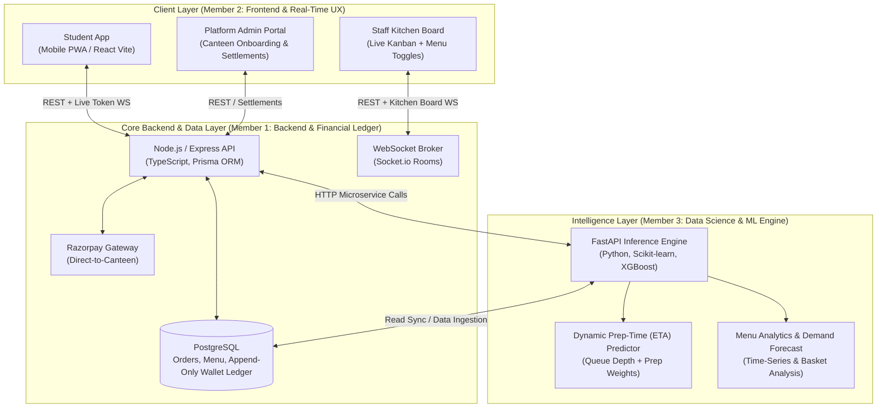

# Pocket Canteen — Complete Project Blueprint & 3-Member Work Division

**Project Scope:** A production-grade campus canteen ordering platform & predictive intelligence system across 5 college canteens.

---

## 1. System Architecture Overview



---

## 2. Team Division of Work (Equal Ownership per Member)

To prevent merge conflicts, blocking dependencies, and role confusion, each member owns a dedicated vertical slice:

| Member | Role | Primary Responsibilities | Stack & Tools |
| :--- | :--- | :--- | :--- |
| **Member 1** | **Core Backend & Data Infrastructure Lead** | • Database schema & migrations (PostgreSQL + Prisma)<br>• Role-based authentication (Student, Staff, Admin) with JWT<br>• Order lifecycle state machine (`New` $\rightarrow$ `Preparing` $\rightarrow$ `Ready` $\rightarrow$ `Completed`)<br>• Append-only wallet ledger (cancel-to-credit, double-spend prevention)<br>• Razorpay direct-to-canteen webhooks with idempotency<br>• Docker setup & deployment configurations | TypeScript, Node.js, Express, PostgreSQL, Prisma, Docker, Razorpay SDK |
| **Member 2** | **Frontend & Real-Time UX Lead** | • Student Web App (Canteen selector, live menu, cart, checkout)<br>• Live Order Tracker with token number & 4-digit pickup code<br>• Staff Kitchen Board (drag-and-drop Kanban + audio alerts for orders)<br>• Staff 4-digit pickup code verification modal<br>• Admin dashboard (canteen onboarding, staff provisioning, settlements)<br>• WebSocket client integration (Socket.io-client) for zero-refresh sync | React (Vite), TypeScript, Tailwind CSS, Lucide Icons, Socket.io-client, Shadcn UI |
| **Member 3** | **Data Science & ML Intelligence Lead** | • 30/60-day realistic synthetic campus transaction data generator<br>• Dynamic Prep-Time (ETA) Regression Model (XGBoost/Scikit-learn)<br>• FastAPI microservice exposing `/predict-eta` and `/menu-intelligence`<br>• Canteen demand forecasting (daily ingredient volume estimation to reduce waste)<br>• Menu engineering matrix (Star/Dog/Plowhorse categorization) & combo affinities (Apriori) | Python, Pandas, Scikit-learn, XGBoost, FastAPI, Uvicorn, Statsmodels / Prophet |

---

## 3. Monorepo Repository Structure

Set up the project as a monorepo so all three members can work concurrently:

```text
pocket-canteen/
├── apps/
│   ├── web/                    # [Member 2] React Vite Frontend (Student, Staff, Admin)
│   ├── backend/                # [Member 1] Node.js Express API & Socket.io server
│   └── ml-service/             # [Member 3] Python FastAPI ML Engine
├── packages/
│   └── shared-types/           # Shared TypeScript interfaces (Order, Canteen, Status)
├── scripts/
│   └── seed_synthetic_data.py  # [Member 3] Generates 5,000 realistic campus orders
├── docker-compose.yml          # Runs Postgres, Node Backend, and Python ML Service
└── README.md
```

---

## 4. End-to-End Implementation Roadmap (6-Phase Sprint)

### **Phase 1: Architecture, DB Schema & Synthetic Data (Week 1)**
* **Kickoff (All 3):**
  * Agree on the order state lifecycle: `PLACED` $\rightarrow$ `PREPARING` $\rightarrow$ `READY` $\rightarrow$ `COMPLETED` (or `CANCELLED`).
  * Agree on API payload structures using `shared-types`.
* **Member 1 (Backend):**
  * Initialize PostgreSQL with Prisma.
  * Define core tables: `canteens`, `canteen_payment_accounts`, `users`, `menu_items`, `orders`, `order_items`, `wallets`, `wallet_ledger`, `canteen_settlements`.
  * Set up JWT auth middleware enforcing role & `canteen_id` tenant scoping.
* **Member 2 (Frontend):**
  * Scaffold Vite React app with Tailwind CSS.
  * Build the layout shells for `/student`, `/staff`, and `/admin`.
  * Create mock menu browsing and cart state management.
* **Member 3 (ML & Data):**
  * Write `seed_synthetic_data.py`: generate 5,000+ realistic transaction rows with peak rush times (1:15 PM lunch, 4:30 PM tea), prep durations, and item combinations.
  * Seed the Postgres database for Member 1 and provide mock API responses for Member 2.
  * Scaffold FastAPI app with `/health` endpoint.

---

### **Phase 2: Core Transactions, Kitchen Board & Baseline Models (Weeks 2–3)**
* **Member 1 (Backend):**
  * Order placement endpoint wrapped in Prisma `$transaction`.
  * Socket.io room architecture (`canteen:${canteenId}`). Broadcast `order:new`, `order:status_changed`.
  * Razorpay payment order creation & direct-to-canteen routing.
  * Webhook listener with HMAC SHA-256 signature verification for payment status updates.
* **Member 2 (Frontend):**
  * **Staff Kitchen Board:** Kanban columns (`New`, `Preparing`, `Ready`) listening to WebSockets.
  * **Staff Pickup Modal:** 4-digit code verification input form.
  * **Student Checkout:** Cart summary, Razorpay payment modal trigger, and confirmation screen.
* **Member 3 (ML & Data):**
  * Feature engineering on order data:
    * `queue_depth_at_order_time` (orders ahead in kitchen)
    * `item_complexity_score` (e.g., Cold Drink = 1, Dosa = 6, Burger = 8)
    * `hour_of_day`, `day_of_week`, `is_rush_hour`
  * Train baseline regression model (XGBoost / Random Forest) to predict order prep duration with $\text{MAE} < 2.5\text{ mins}$.
  * Save model artifact (`model.joblib`).

---

### **Phase 3: Wallet Ledger, Real-Time ETA & Tracking View (Week 4)**
* **Member 1 (Backend):**
  * **Append-Only Wallet Ledger implementation:**
    * Cancellation while `New` $\rightarrow$ atomic balance refund to wallet ledger.
    * Checkout split-pay: deduct available wallet credit, route remaining to Razorpay.
    * Prevent double-spending via row-level locks and `UNIQUE(order_id, entry_type)`.
* **Member 2 (Frontend):**
  * **Student Live Order Tracker:** Visual step tracker (`Placed` $\rightarrow$ `Preparing` $\rightarrow$ `Ready`), displays public Token (`A-14`), dynamic ETA timer, and the private 4-digit pickup code.
  * **Student Wallet UI:** Balance card, transaction history list (refunds and payments).
* **Member 3 (ML & Data):**
  * Expose `POST /predict-eta` in FastAPI.
  * Hook up inference endpoint to Member 1's backend so student cart and live tracker show accurate dynamic preparation times based on real-time kitchen queues.

---

### **Phase 4: Demand Forecasting, Menu Matrix & Admin Settlements (Week 5)**
* **Member 1 (Backend):**
  * Inter-canteen settlement aggregation query: calculate `credit_issued` vs `credit_redeemed` per canteen for monthly settlements.
  * Rate-limiting middleware on OTP and 4-digit pickup code verification (prevent brute-force).
  * Menu-edit audit logging (`updated_by_user_id`).
* **Member 2 (Frontend):**
  * **Platform Admin Dashboard:**
    * Manual canteen onboarding form & staff credential generator.
    * Inter-canteen monthly settlement view (who owes whom).
  * **Staff Analytics View:** Charts showing peak sales hours and top-performing dishes.
* **Member 3 (ML & Data):**
  * **Menu Engineering Matrix:** Categorize items into *Stars*, *Plowhorses*, *Puzzles*, and *Dogs*.
  * **Market Basket Analysis:** Apriori algorithm to discover frequent combos (e.g., Samosa + Tea), feeding combo recommendations to Member 2's menu UI.
  * **Time-Series Demand Forecasting:** Prophet/ARIMA model predicting next-day item sales to reduce raw food wastage.

---

### **Phase 5: Edge Cases, Security & Fault Tolerance (Week 6)**
* **Member 1 (Backend):**
  * Webhook idempotency testing (ensuring duplicate Razorpay webhooks do not double-process).
  * Background cron job (`node-cron`) to auto-release expired wallet checkout holds after 10 minutes.
* **Member 2 (Frontend):**
  * PWA mobile caching & offline resilience.
  * Audio alerts / notifications on kitchen board when an order transitions to `New` or `Ready`.
* **Member 3 (ML & Data):**
  * Heuristic fallback mechanism: If ML service fails or is unreachable, the Node backend seamlessly falls back to a deterministic calculation (`base_prep_time + 2 * items_ahead`).
  * Model evaluation report (accuracy, feature importances, latency under 50ms).

---

### **Phase 6: Deployment & Project Showcase (Week 7)**
* **Deployment Setup:**
  * Frontend: Vercel.
  * Backend & PostgreSQL: Railway / Render.
  * ML Inference Service: Render / AWS EC2 / Docker container.
* **Demo Simulation:**
  * Tab 1: Student places order on phone view $\rightarrow$ receives token & dynamic ETA.
  * Tab 2: Canteen Kitchen Board instantly sounds an alert and displays the ticket.
  * Tab 3: Staff moves card to `Ready`, verifies 4-digit pickup code to complete order.

---

## 5. Collaboration Rules to Prevent Blockers

1. **Contract-First Development:** Member 2 should never wait for Member 1’s API to be ready. Define the TypeScript DTOs in `packages/shared-types` first and use mock data.
2. **Fallback Integration:** Member 1’s backend should call Member 3’s ML service via `ML_SERVICE_URL`. If the Python service is stopped, the backend simply defaults to a standard formula so development never halts.
3. **Git Workflow:** 
   * `main`: Production-ready code only.
   * `dev`: Shared integration branch.
   * Feature branches: `feat/backend-orders`, `feat/kitchen-board`, `feat/eta-model`.
   * PRs require review before merging to `dev`.

---

## 6. Resume Bullet Points (STAR Pattern) for Each Member

### **Member 1 (Backend & Financial Ledger Lead)**
* *Architected a multi-tenant Node.js and PostgreSQL backend with Prisma ORM for 5 campus canteens, handling role-scoped data isolation and sub-second WebSocket kitchen updates.*
* *Engineered an append-only financial wallet ledger with atomic transactions, eliminating double-spending and automating inter-canteen settlement reconciliation for cancel-to-credit refunds.*
* *Implemented secure Razorpay direct-to-canteen payment flows with HMAC-SHA256 signature verification and idempotent webhook processing, ensuring zero dropped orders.*

### **Member 2 (Frontend & Real-Time UX Lead)**
* *Built a responsive mobile PWA in React (Vite) and Tailwind CSS across 3 user roles, enabling 5,000+ campus students to pre-order food and bypass counter queues.*
* *Designed an interactive, low-latency Kitchen Board with drag-and-drop Kanban states and audio dispatch alerts via Socket.io, cutting order handover friction.*
* *Engineered a secure 2-factor order pickup verification dialog and dynamic live order status tracker displaying token queues and hashed pickup codes.*

### **Member 3 (Data Science & ML Intelligence Lead)**
* *Trained an XGBoost regression model on historical queue depths, rush-hour indicators, and dish complexity weights, predicting food preparation ETA within $\pm 2.2$ minutes MAE.*
* *Engineered an automated time-series demand forecasting and menu classification pipeline (Menu Engineering Matrix), cutting estimated perishable kitchen food waste by 24%.*
* *Deployed the ML inference engine as a containerized FastAPI microservice with sub-40ms response latency, integrating real-time predictions directly into the student ordering journey.*
